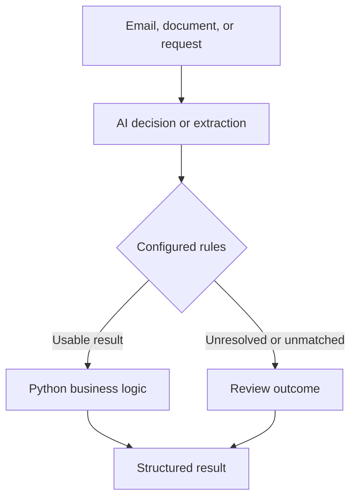

# Foliqant

Foliqant is a Python library for processes that combine **AI interpretation with
deterministic control flow**. Use models to classify an email, label a request,
or extract document fields. Use configured routes and trusted Python functions
to decide what happens next.



- A **workflow** defines the overall process, its input, allowed routes, and output.
- A **flow** runs steps in a fixed order, then follows a configured transition.
- A **step** performs one task: an AI `decision`, `llm` extraction or text
  generation, a trusted Python `handler`, an `mcp` tool call, or a bounded
  `flow_collection` of explicitly planned callable flows.

The model interprets data; it does not invent the workflow graph. Typed results
and explicit review paths make its output usable by application code, but do
not guarantee model accuracy. Measure that with reviewed evaluation data.

Execution runs in memory inside your Python application and returns one
structured result. Your host owns HTTP, authentication, persistence, and any
human review interface.

[Documentation](docs/index.md) · [Install](#install) · [Quick start](#quick-start) ·
[Build with an AI agent](#build-with-an-ai-agent) · [Tutorials and guides](#learn-the-runtime)

## Install

Foliqant supports CPython 3.12. The source-checkout instructions below use
[uv](https://docs.astral.sh/uv/); the project does not currently claim a
package-index release. Install the locked environment from a reviewed checkout
and select the adapters your application needs:

```sh
git clone https://github.com/sebastianwessel/foliqant.git
cd foliqant
uv sync --locked --no-dev --extra openai
source .venv/bin/activate
```

Available extras include `openai`, `azure`, `anthropic`, `mcp`, and
`telemetry`.

## Quick start

Create a project and copy its environment template:

```sh
foliqant init /tmp/foliqant-demo
cp /tmp/foliqant-demo/config/.env.example /tmp/foliqant-demo/config/.env
```

Set the explicitly served model in `/tmp/foliqant-demo/config/.env`:

```dotenv
MODEL_ID=your-served-model-id
MODEL_BASE_URL=http://127.0.0.1:8000/v1
```

Compile offline, inspect the plan, then run one envelope:

```sh
cd /tmp/foliqant-demo
foliqant validate
foliqant explain --workflow demo
foliqant run \
  --workflow demo \
  --input envelope.json
```

Commands run from a workflow project use `config/settings.yaml` by default.
`validate`, `explain`, and `doctor` compile offline. `run` opens only the
model and tool clients declared by that project and prints one JSON result.

## Build with an AI agent

Install the bundled `foliqant` skill from your application directory using
[Vercel's Skills CLI](https://github.com/vercel-labs/skills). The installer needs
Node.js/npm; the application itself runs in Python.

```sh
npx skills add sebastianwessel/foliqant --skill foliqant
```

Choose your coding agent when prompted. Installation is project-local by
default; add `--global` to use it across projects. Private repository access
requires configured Git credentials.

Ask your agent to use the `foliqant` skill, then provide your business process,
category descriptions, routing rules, and reviewed input/output examples. The
skill guides workflow design, configuration, Python integration, and evaluation;
it does not install the Python runtime or supply business rules for you.

Follow [Build a solution with the skill](docs/skills/foliqant.md#build-a-solution-with-the-skill)
for a ready-to-adapt prompt and the expected deliverables.

## Learn the runtime

New to Foliqant? Follow the [six-stage tutorial path](docs/tutorials/index.md)
from a single decision to a multi-request workflow with MCP and a model tool
loop:

1. [Classify one request](docs/tutorials/decision-basics.md)
2. [Add structured extraction](docs/tutorials/structured-extraction.md)
3. [Route between flows](docs/tutorials/multiflow-routing.md)
4. [Call one read-only MCP tool](docs/tutorials/read-only-mcp.md)
5. [Let a model use a read-only tool](docs/tutorials/model-tool-loop.md)
6. [Process several requests conservatively](docs/tutorials/multi-request-processing.md)

| Goal | Guide |
| --- | --- |
| Install, scaffold, and embed Foliqant | [Install and run](docs/getting-started/runtime.md) |
| Understand workflows, flows, steps, and results | [Runtime concepts](docs/concepts/runtime.md) |
| Author files, bindings, prompts, routes, and schemas | [Build a workflow](docs/guides/build-workflows.md) |
| Author typed evidence-backed decisions | [Decision contracts](docs/guides/decision-contracts.md) |
| Configure providers, MCP, limits, telemetry, and CLI behavior | [Runtime configuration](docs/reference/runtime-configuration.md) |
| Test pipelines, flows, and steps against reviewed gold | [Testing and evaluation](docs/guides/testing-and-evaluation.md) |
| Install the skill and build with a coding agent | [Build with the skill](docs/skills/foliqant.md) |

Browse the [documentation home](docs/index.md) or the runnable
[`examples/`](examples/) directory. Live model measurements are opt-in; small
synthetic fixtures and successful smoke runs establish wiring, not general
quality, security, latency, or cost.
