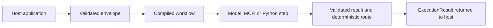

# Runtime and model development

The workflow runtime and model-development tools solve different problems and
use separate uv projects.

| Concern | Runtime package | Model project |
| --- | --- | --- |
| Location | root `src/foliqant` | `model/src/foliqant_model` |
| Command | `foliqant` | `foliqant-model` |
| Input | envelopes and workflow bundles | source manifests and artifact configs |
| Output | one in-memory `ExecutionResult` | versioned datasets, adapters, reports, and exports |
| Network behavior | only explicitly configured model or MCP clients | downloads only in setup/fetch/curation commands |
| Persistence | none | caller-selected artifact directories outside Git |

An application can use any explicitly configured compatible model. The runtime
does not train, download, discover, or serve one. The model project can create
and qualify model artifacts, but it does not expose workflows over HTTP or add
application authentication.

The normal runtime flow is:

Everything happens while the caller awaits the Python method. Admission limits
bound concurrent work, but they do not create background jobs. Cancellation is
returned to the caller; process shutdown cannot recover an unfinished run.

The model lifecycle is an explicit sequence: acquire or curate source data,
prepare it, train, evaluate and calibrate, audit, export, then verify the exported
artifact. Outputs retain lineage and must live outside the checkout. Completing
that lifecycle does not by itself qualify a model for a financial production
decision; qualification depends on the intended domain and acceptance criteria.

Use [runtime setup](../getting-started/runtime.md) for application work. Use
[model setup](../getting-started/setup.md) when changing weights or datasets.
