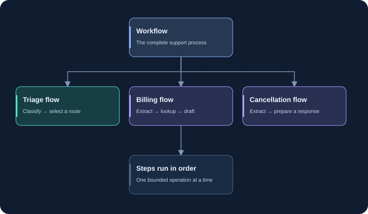
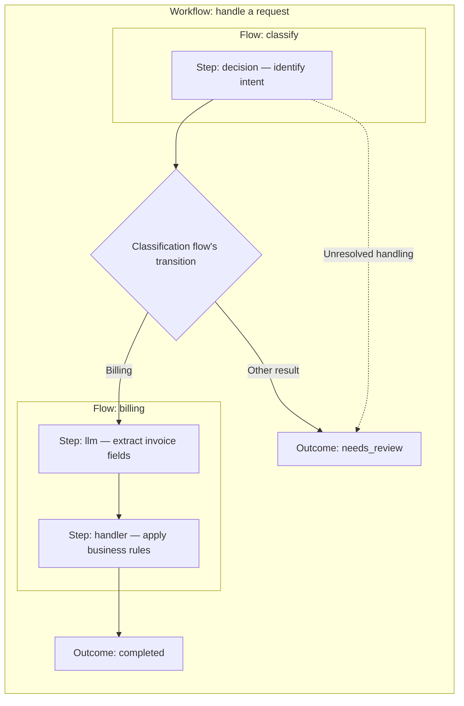

# Understand workflows, flows, and steps

Imagine an incoming support email. You need to identify its request, collect
relevant facts, and prepare a response—or ask a person to review it. Foliqant
organizes that process into a workflow, its flows, and their individual steps.

Your application sends one input and awaits one result. The process runs in
memory, using only the routes and operations you defined.

## Map the business process

Use the three runtime levels deliberately:

| Level | Represents | Owns |
| --- | --- | --- |
| Workflow | One capability invoked by the application | Public input, starting flow, graph, final payload |
| Flow | One sequential business boundary | Resolved input, ordered steps, result projection, next route |
| Step | One atomic unit of model, tool, or trusted code work | Selected input, instructions, schema, typed result |

A workflow may contain one flow or route across several. A flow may contain one
or more ordered steps. Steps never select the next flow; the containing flow
owns transitions and unresolved handling.

The diagram shows ownership. The process below shows how a configured route
selects the next flow. Both routes and step order are defined by your application.

This illustrative process uses three of the five step types. A declared `mcp`
step can read from an external tool; a `flow_collection` step can collect work
from callable flows. The diagram's arrows between flows represent authored
transitions, not model-generated instructions. The completed path assumes the
billing steps succeed; validation and execution failures remain visible in the
result rather than becoming a successful business outcome.

Choose a new flow when the process needs a separately testable boundary, a
route, or explicit review handling. Choose another step when work remains in the
same sequential boundary but needs a different input, schema, provider, tool, or
trusted handler.

For a reviewed list of independent items, a `flow_collection` step can invoke
allowlisted callable flows sequentially. A trusted planner must produce each
item's ID, callable flow, and complete child input. Callable flows have no graph
transition and cannot become the workflow start or route targets. The collection
returns an ordered child ledger so final policy can consider completed, review,
failed, and skipped work together.

## Compile, open, and run

`prepare_application` reads strict local configuration, resolves definitions
and schemas, checks graph and binding references, validates declared provider
capabilities, and freezes the compiled resources. It does not read `.env`, open
network clients, or execute the workflow.

`open_application` resolves marked environment fields and opens configured
clients. Keep that async context open while the host accepts work. Call
`application.run(workflow, envelope)` for normal business execution.
`run_flow` and `run_step` accept already-resolved boundary input and are useful
for focused tests and evaluation.

Every call runs in the foreground. Admission limits bound work inside one
process; they do not create persistent jobs. The host owns transport,
authentication, rate control, idempotency, and result storage.

## Pass selected context

Bindings copy explicit JSON values from the current boundary. A step receives
only its declared input. Each model step starts a fresh conversation; prior
prompts, messages, and envelope fields are not forwarded implicitly.

Within a flow, bindings to earlier steps use `/steps/{step}/...`. Workflow
routes and output projections use `/flows/{flow}/...`. The public result places
step records under `/flows/{flow}/steps/{step}` and exposes a projected workflow
value at top-level `payload`.

## Keep authority separate from data

Instructions, decision questions and criteria, schemas, routes, and tool
allowlists are authored policy. Bound source values, metadata, prompt
substitutions, and prior model or tool results are data. The model adapters state
this boundary explicitly, while still permitting an authored task to classify,
extract, transform, or quote instruction-like text.

Runtime validation and scoped tool authorization remain required. Prompt policy
alone cannot prove that every provider will follow the boundary. Use reviewed
adversarial cases when the business process handles untrusted text.

## Treat unresolved results as process state

Each decision result reports `answerable`, `partially_answerable`,
`not_answerable`, or `undetermined`, with stable issue codes and evidence strength.
A validated fallback may supply a
separate process selection for a single-choice question, but it does not rewrite
the native answer.

Flows route unresolved work explicitly through `on_unresolved`; it cannot fall
through to a successful downstream action. The public result keeps transitions,
native observations, fallback selections, and terminal status available for
review.

See [Inputs, results, and errors](../reference/inputs-and-results.md) for the
complete public shapes and the distinction between an unresolved decision and
an execution failure.

Continue with [workflow authoring](../configuration/workflows.md), then add
[reviewed evaluation cases](../evaluation/index.md) at the full
pipeline and any useful flow or step boundaries.
