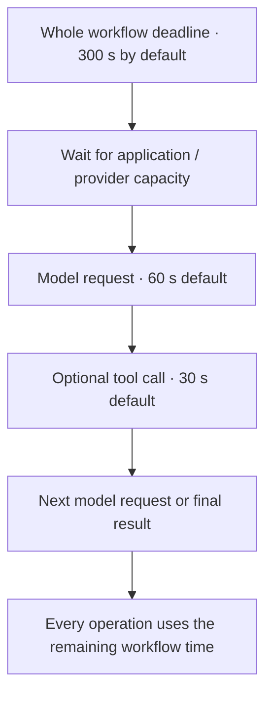

# Bound time, cost, and concurrency

Start with the defaults for a short classification or extraction workflow. Add
settings only when your process needs a different budget. Bounds stop a slow
provider or an agent loop from consuming unbounded time and requests; they do not
guarantee accuracy or a particular latency.

## Know the defaults

These fields belong under `execution` in `config/settings.yaml`. Every field is
optional, and all durations are seconds.

| Field | Default | What it limits |
| --- | ---: | --- |
| `concurrency` | `4` | Active workflow calls per application process |
| `queue_limit` | `16` | Additional calls allowed to wait in memory |
| `run_timeout` | `300` | Entire call, including waiting, all flows, and child collections |
| `model_timeout` | `60` | One logical model request, including its retries after first admission |
| `tool_timeout` | `30` | MCP connection/discovery or logical tool call, also bounded by the server profile |
| `max_steps` | `32` | Total visited operations, including collection steps and child operations |
| `model_requests_per_step` | `4` | Model attempts within each step, including retries and the final answer |
| `tool_calls_per_step` | `3` | External tool attempts within each step, including retries |

Execution concurrency and counts must be positive integers, at most `1024`.
`queue_limit` allows `0` through `65536`; durations must be positive and at most
`3600`. Setting a queue limit to `0` rejects work immediately when all active
slots are occupied. This is admission control, not a durable job queue.

Model and MCP profiles have their own independent limits:

| Profile field | Model default | MCP default |
| --- | ---: | ---: |
| `concurrency` | `4` | `4` |
| `queue_limit` | `16` | `16` |
| `request_timeout` | `60` | `30` |
| `retry.max_attempts` | `1` | `1` |
| `options.max_tokens` | `4096` output tokens | Not applicable |
| `output_limit_bytes` | Not applicable | `1048576` (1 MiB) |

Profile concurrency allows `1`–`1024`, queues `0`–`10000`, and timeouts up to
`3600` seconds. MCP output limits allow up to 64 MiB, but smaller results reduce
latency and prompt size. Profile overrides on steps share the original model
profile's admission limit; they do not create extra capacity.

## Understand which timeout wins



The remaining workflow deadline always applies. The model runtime deadline and
provider SDK timeout are additional bounds; increasing only the provider's
`request_timeout` does not raise `execution.model_timeout`. MCP uses the smaller
of the server timeout and `execution.tool_timeout`, within the remaining run time.
An explicit caller deadline can shorten the run but cannot extend it.

Timeout and cancellation stop local waiting. They cannot prove that a remote
provider stopped processing. Do not immediately retry an ambiguous timed-out
request as if no work happened. See [error handling](../integration/errors.md).

## Size an agent loop

An LLM step has an optional `max_iterations` setting, defaulting to `4` (an
integer from `1` to `1024`). It counts model turns, including the final answer.
One model turn can request several tools, so a turn is not the same as a tool
call. Retries consume model-request attempts but do not create another logical
turn.

The default four model requests and three tool calls allow, for example, three
one-tool rounds followed by a final model answer, provided no retries consume
those budgets and the deadlines allow it. They are ceilings, not a promise that
every run makes that many calls. Exhaustion returns `budget_exhausted`; an
unfinished answer is not published as a successful result.

For a more involved lookup, add `max_iterations: 8` to that LLM step and raise
the application request budgets in `config/settings.yaml`:

```yaml
execution:
  model_requests_per_step: 8
  tool_calls_per_step: 6
```

Application request budgets apply to every step. A step's `max_iterations` can
further restrict its conversation; it cannot override the application limits.
Multiple MCP tools must still be explicitly allowlisted. See
[let a model use tools](../steps/agent-loops.md).

## Configure a slow local model

A local reasoning model may need more time and less concurrency than a hosted
model. This is an explicit development profile, not the library default:

```yaml
execution:
  concurrency: 1
  queue_limit: 0
  run_timeout: 900
  model_timeout: 300
models:
  local:
    provider: openai_compatible
    model: $MODEL_ID
    base_url: $MODEL_BASE_URL
    allow_insecure_http: true
    output_mode: native
    supports_tools: false
    concurrency: 1
    queue_limit: 0
    request_timeout: 300
```

Keep generation options at provider defaults until the endpoint's supported
settings are known. Lower temperature is not proof of repeatability or correctness.
Measure [quality and latency](../evaluation/results.md) on your actual inputs.

## Enable retries only for completed transient failures

Both model and MCP profiles accept:

```yaml
retry:
  max_attempts: 2
  initial_delay_seconds: 0.25
  max_delay_seconds: 5
```

The defaults are one attempt, `0.25` seconds initial delay, and `5` seconds maximum
delay. Attempts allow `1`–`8`; initial delay allows `0`–`60`, maximum delay `0`–`300`
and must be at least the initial delay. Delay is capped exponential full jitter;
a valid `Retry-After` is a lower bound, subject to the cap and remaining deadline.

Only safely observed completed HTTP responses `429`, `500`, `502`, `503`, and
`529` qualify. Invalid `Retry-After`, timeouts, interrupted connections, invalid
output, authentication failures, and cancellation do not. Provider SDK retries
and automatic output-repair retries are disabled. Each actual retry consumes
the same step budget; it does not restart the workflow or reset its deadline.

## Choose practical bounds

| Situation | Start with | Revisit when |
| --- | --- | --- |
| One classification or extraction | Defaults | Truncation, latency, or input size measurements justify a change |
| Local model on one machine | One concurrent run and request | You have measured spare capacity |
| One or two read-only lookups | Default loop budgets | Legitimate cases need more calls |
| Many request units | Explicit `max_items` and sufficient `max_steps` | The configured item ceiling exceeds available operation budget |
| Public HTTP endpoint | Host request/body limits plus runtime bounds | Load tests show queueing or timeouts |

The defaults are conservative starting points for bounded request processing.
They are not a measured claim that 90% of arbitrary workflows will fit. Keep
failed and over-budget cases visible in [evaluations](../evaluation/index.md)
before loosening a limit.
