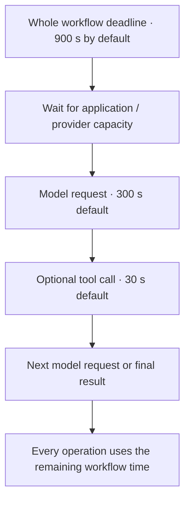

# Bound time, cost, and concurrency

Limits are safety nets. They stop a slow provider, a runaway generation or an
agent loop from consuming unbounded time, tokens and requests; they are sized
for the worst realistic case with headroom, not for the typical request, so a
long e-mail thread, a complex context or a reasoning model does not hit them.
They do not guarantee accuracy or a particular latency. A run that reaches one
fails with the limit's own code (see [errors](../integration/errors.md)); it is
never turned into a business outcome.

## Know the defaults

These fields belong under `execution` in `config/settings.yaml`. Every field is
optional, and all durations are seconds.

| Field | Default | What it limits |
| --- | ---: | --- |
| `concurrency` | `4` | Active workflow calls per application process |
| `queue_limit` | `16` | Additional calls allowed to wait in memory |
| `run_timeout` | `900` | Entire call, including waiting, all flows, and child collections (`run_timeout`) |
| `model_timeout` | `300` | One logical model request, including its retries after first admission (`request_timeout`) |
| `tool_timeout` | `30` | MCP connection/discovery or logical tool call, also bounded by the server profile (`request_timeout`) |
| `max_steps` | `128` | Total visited operations, including collection steps and child operations (`step_limit_reached`) |
| `model_requests_per_step` | `16` | Model attempts within each step, including retries, output corrections and the final answer (`model_request_limit_reached`) |
| `tool_calls_per_step` | `16` | External tool attempts within each step, including retries (`tool_call_limit_reached`) |

The defaults let one request generate the default output budget of a reasoning
model (`model_timeout`), a run make several such requests (`run_timeout`), and
a step run a multi-turn tool loop with retries and an output correction.

Execution concurrency and counts must be positive integers, at most `1024`.
`queue_limit` allows `0` through `65536`; durations must be positive and at most
`3600`. Setting a queue limit to `0` rejects work immediately when all active
slots are occupied. This is admission control, not a durable job queue.

Model and MCP profiles have their own independent limits:

| Profile field | Model default | MCP default |
| --- | ---: | ---: |
| `concurrency` | `4` | `4` |
| `queue_limit` | `16` | `16` |
| `request_timeout` | `300` | `30` |
| `retry.max_attempts` | `4` (the first request plus three retries) | `4` |
| `output_retries` | `1` | Not applicable |
| `options.max_tokens` | `32768` output tokens, reasoning included | Not applicable |
| `output_limit_bytes` | Not applicable | `1048576` (1 MiB) |

`max_tokens` defaults to 32,768 because a reasoning model's reasoning tokens
count against it and it may reason for tens of thousands of tokens before it
answers. A model whose maximum output is smaller rejects the request
(`request_rejected`): lower `max_tokens` for it. An OpenAI-compatible server
such as vLLM counts `max_tokens` against the context window, so the input plus
`max_tokens` must fit the served context (`context_limit_exceeded` otherwise).

Profile concurrency allows `1`–`1024`, queues `0`–`10000`, and timeouts up to
`3600` seconds. MCP output limits allow up to 64 MiB, but smaller results reduce
latency and prompt size. Profile overrides on steps share the original model
profile's admission limit; they do not create extra capacity.

## Understand which timeout wins



The remaining workflow deadline always applies. The model runtime deadline and
provider SDK timeout are additional bounds; increasing only the provider's
`request_timeout` does not raise `execution.model_timeout`. MCP uses the smaller
of the server timeout and `execution.tool_timeout`, within the remaining run time.
An explicit caller deadline can shorten the run but cannot extend it.

A timeout reports which bound it hit: `request_timeout` when a request's own
timeout expired while the run had time left, `run_timeout` when the run's
deadline was the bound. Timeout and cancellation stop local waiting. They cannot
prove that a remote provider stopped processing, so a client-side request
timeout is not retried. Size `model_timeout` for the slowest realistic request:
the output budget divided by the slowest generation rate, plus the time to read
a long input. See [error handling](../integration/errors.md).

## Size an agent loop

An LLM step has an optional `max_iterations` setting, defaulting to `8` (an
integer from `1` to `1024`). It counts model turns, including the final answer.
One model turn can request several tools, so a turn is not the same as a tool
call. Provider retries and output corrections consume model-request attempts
but do not create another logical turn.

The defaults of eight turns, sixteen model requests and sixteen tool calls allow,
for example, seven tool rounds followed by a final answer, with room for
retries. They are ceilings, not a promise that every run makes that many calls.
Each limit fails with its own code (`iteration_limit_reached`,
`model_request_limit_reached`, `tool_call_limit_reached`); an unfinished answer
is not published as a successful result.

For a longer lookup, raise that LLM step's `max_iterations` and the application
request budgets in `config/settings.yaml`:

```yaml
execution:
  model_requests_per_step: 32
  tool_calls_per_step: 24
```

Application request budgets apply to every step. A step's `max_iterations` can
further restrict its conversation; it cannot override the application limits.
Multiple MCP tools must still be explicitly allowlisted. See
[let a model use tools](../steps/agent-loops.md).

## Configure a slow local model

A local reasoning model may need more time and less concurrency than a hosted
model. This is an explicit development profile, not the library default:

```yaml
execution:
  concurrency: 1
  queue_limit: 0
  run_timeout: 3600
  model_timeout: 900
models:
  local:
    provider: openai_compatible
    model: $MODEL_ID
    base_url: $MODEL_BASE_URL
    allow_insecure_http: true
    output_mode: native
    supports_tools: false
    concurrency: 1
    queue_limit: 0
    request_timeout: 900
    options:
      max_tokens: 16384
```

At 20 tokens per second, 16,384 output tokens take about 820 seconds, so the
request and model timeouts allow one full-budget request. Keep other generation
options at provider defaults until the endpoint's supported settings are known. Lower temperature is not proof of repeatability or correctness.
Measure [quality and latency](../evaluation/results.md) on your actual inputs.

## Retry transient failures

Both model and MCP profiles accept:

```yaml
retry:
  max_attempts: 4
  initial_delay_seconds: 1
  max_delay_seconds: 30
```

These are the defaults: the first request plus up to three retries, `1` second
initial delay and `30` seconds maximum delay. Attempts allow `1`–`8` (`1`
disables retries); initial delay allows `0`–`60`, maximum delay `0`–`300` and
must be at least the initial delay. Delay is capped exponential full jitter; a
valid `Retry-After` is a lower bound, subject to the cap and remaining deadline.

Only the completed HTTP responses `408`, `429`, `500`, `502`, `503`, `504` and
`529` qualify, and for models also a connection failure without a response. A
client-side timeout, an invalid `Retry-After`, invalid requests, authentication
failures, output limits, refusals, the step limits and cancellation do not: they
recur or waste resources ([retry decisions](../integration/errors.md#retry-decisions)).
Provider SDK retries are disabled. Each actual retry consumes the same step
budget; it does not restart the workflow or reset its deadline. Invalid model
output is corrected by `output_retries` instead
([output retries](../integration/errors.md#output-retries)).

## Choose practical bounds

| Situation | Start with | Revisit when |
| --- | --- | --- |
| One classification or extraction | Defaults | Truncation, latency, or input size measurements justify a change |
| Local model on one machine | One concurrent run and request | You have measured spare capacity |
| One or two read-only lookups | Default loop budgets | Legitimate cases need more calls |
| Many request units | Explicit `max_items` and sufficient `max_steps` | The configured item ceiling exceeds available operation budget |
| Public HTTP endpoint | Host request/body limits plus runtime bounds | Load tests show queueing or timeouts |

The defaults are conservative starting points for bounded request processing.
They are not a measured claim that 90% of arbitrary workflows will fit. Keep
failed and over-budget cases visible in [evaluations](../evaluation/index.md)
before loosening a limit.
