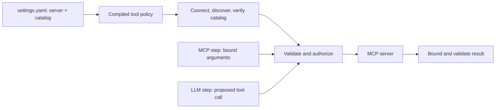

# Connect MCP tools

MCP connects a workflow to an external tool server. Foliqant supports
Streamable HTTP and local stdio servers. Built-in access is **read-only**:
declare reviewed tool schemas and allow only the calls needed by the process.

There are two ways to use a configured server:

| Use case | Step | Who selects arguments? |
| --- | --- | --- |
| The process already knows which lookup to perform | [`mcp`](../steps/mcp.md) | Authored bindings, often using an earlier extraction |
| The model needs to choose a lookup while answering | [`llm` with tools](../steps/agent-loops.md) | The model, inside the compiled allowlist and request budgets |

Both paths validate arguments, authorize each call, bound the returned data,
and validate the result. Neither lets a model create workflow routes or grant
itself new tools.



## Install the client adapter

From the source checkout:

```sh
uv sync --locked --extra mcp
```

For a model tool loop, install its model adapter too, for example
`uv sync --locked --extra mcp --extra openai`. The external server has its own
dependencies and lifecycle; the MCP extra installs the client integration.

## Declare a server and its catalog

Add this complete `mcp` settings fragment to `config/settings.yaml`:

```yaml
mcp:
  records:
    transport:
      type: streamable_http
      endpoint: $MCP_ENDPOINT
    catalog:
      tools:
        lookup:
          effect: read
          input_schema:
            type: object
            properties:
              reference:
                type: string
            required:
              - reference
            additionalProperties: false
          output_schema:
            type: object
            properties:
              status:
                type: string
            required:
              - status
            additionalProperties: false
```

Set `MCP_ENDPOINT` in `config/.env` to the full Streamable HTTP endpoint, such
as `https://records.example.com/mcp`. This example describes the required
server contract; it does not create a server at that address. For a runnable
local server, use the
[public-request example](https://github.com/sebastianwessel/foliqant/blob/main/examples/public_request_mcp/README.md).

`records` is the settings alias used by steps; `lookup` is the actual server
tool name. The catalog is authored policy, not permission to use any advertised
tool. At runtime the integration checks the server's advertised schema against
the declaration before using it. Review both sides when a server changes.

| Profile field | Default / requirement |
| --- | --- |
| `transport` | Required; one HTTP or stdio transport |
| `catalog.tools` | Required, nonempty map of reviewed tool declarations |
| `auth` | Optional name of a host-registered HTTP credential provider |
| `identity_meta_key` | Optional reverse-DNS metadata key for tenant/principal context |
| `concurrency` / `queue_limit` | `4` active / `16` waiting sessions per process |
| `request_timeout` | `30` seconds |
| `output_limit_bytes` | `1048576` bytes |
| `retry` | `max_attempts: 4` (the first call plus up to three retries), `initial_delay_seconds: 1`, `max_delay_seconds: 30`; see [retry policy](../reference/runtime-configuration.md#provider-retries) |

The catalog's `input_schema` and `output_schema` describe JSON values. They
are not prompts. Declaring a write tool does not make it usable by the built-in
read-only executor.

## Use a local stdio server

Replace only the profile's `transport` with this fragment; keep its reviewed
catalog:

```yaml
transport:
  type: stdio
  command: $MCP_PYTHON
  args:
    - -m
    - my_application.record_tools
  cwd: $MCP_WORKDIR
  env:
    PYTHONUNBUFFERED: "1"
```

`MCP_PYTHON` is the Python executable containing your server dependencies.
`MCP_WORKDIR` must resolve to an absolute directory. The named module is your
server implementation, not a package supplied by Foliqant. Arguments are
process arguments, not a shell command. Trust the executable and arguments as
deployment code. The child receives the SDK's safe environment plus the
explicit `env` overlay, not an unrestricted copy of host secrets.

Stdio profiles cannot use `auth`; that hook applies only to HTTP. HTTP requires
HTTPS unless `transport.allow_insecure_http: true` explicitly allows local HTTP.

## Add a step

A direct step names exactly one tool and binds its arguments:

```yaml
type: mcp
server: records
tool: lookup
arguments:
  reference:
    pointer: /payload/reference
```

Save it as `lookup.step.yaml`, list `lookup` in the containing `flow.yaml`, and
project `/steps/lookup/result` as the flow output. The full walkthrough is in
[Call a declared MCP tool](../steps/mcp.md). When arguments must be extracted
first, bind to an earlier step's validated result, not its prose explanation.

For an agent loop, the LLM step instead declares `tools.server`, `tools.allow`,
and `tools.choice`; follow [bounded agent loops](../steps/agent-loops.md).

## Configure authenticated HTTP access

Add `auth: records_oauth` to the profile. That name must match an object in
`RuntimePlugins(mcp_credentials={...})`; it is not a token or automatic OAuth
configuration. This host integration fragment assumes you have implemented a
credential provider named `credentials` and prepared the application:

```python
from foliqant import RuntimePlugins, open_application

plugins = RuntimePlugins(mcp_credentials={"records_oauth": credentials})
async with open_application(prepared, environment={}, plugins=plugins) as application:
    result = await application.run("intake", envelope, identity=caller_identity)
```

Here `environment={}` uses values from the adjacent `config/.env`. A host can
pass an explicit environment mapping to override those values.

A provider implements `McpCredentialProvider.create_auth(scope=..., context=...)`
and returns `McpHttpAuthorization`. Scope identifies the server alias, endpoint,
auth reference, and caller identity. `SdkOAuthCredentialProvider` provides the
SDK-based OAuth path: the host supplies client metadata, a token-storage factory,
allowed HTTPS authorization-server origins, and optional operator callbacks.
Token storage must partition by every scope field. The library does not persist
tokens or open an authorization UI.

For that integration's exact interfaces, see
[MCP authentication types](https://github.com/sebastianwessel/foliqant/blob/main/src/foliqant/adapters/mcp/auth.py).
Do not put raw access tokens in the catalog or YAML.

## Separate caller identity and tool authorization

The host authenticates the incoming request and supplies trusted `Identity`.
An optional `identity_meta_key`, such as `example.com/runtime/identity`, forwards
non-null tenant/principal context as MCP metadata. It does not authenticate a
remote call.

The default authorizer enforces the compiled read-only tool allowlist. For
resource-level checks, provide `RuntimePlugins(tool_authorizer=...)` with an
async `authorize(server, tool, arguments, context)` method. Preserve the declared
allowlist and add your business permission checks; raise a safe `ServiceError`
with `ErrorCode.FORBIDDEN` when access is denied. Configuration never imports
arbitrary credential or authorization functions.

## Validate and test

Run `foliqant validate` before starting clients. It checks declarations and
bindings without contacting the server. Missing named credential providers fail
when the application opens. At runtime each boundary fails with its own code:
catalog mismatch `tool_catalog_mismatch`, invalid arguments `invalid_input`,
unauthorized calls `forbidden`, a result with `isError` `tool_error`, an
oversized result `tool_output_limit_exceeded` and an invalid result
`invalid_output` (see [error codes](../integration/errors.md#canonical-error-codes)).

Test valid and invalid arguments, server schema changes, denial, timeout, and
output limits. Use local fakes for policy tests and an explicitly started test
server for transport integration. See [unit testing](../evaluation/unit-testing.md)
and [task-specific evaluation](../evaluation/task-types.md).
