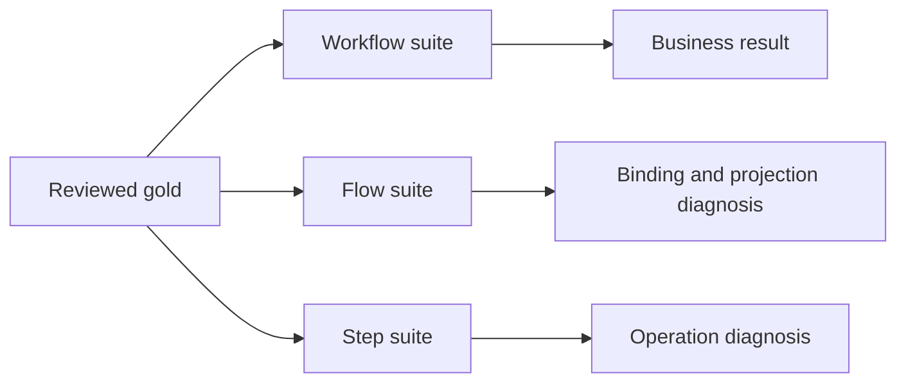

# Evaluate workflows

Evaluation answers a different question from a unit test. A unit test proves
that deterministic wiring, validation, and host integrations behave as coded.
Evaluation measures an executed workflow against reviewed, caller-authored
ground truth.

Foliqant does not infer gold, call an LLM judge, tune prompts, or declare a
winning model. It scores explicit expectations against public
`ExecutionResult` paths.

## Choose an execution scope

Use all three scopes while developing a workflow:

| Scope | Dataset target | What executes | Best use |
| --- | --- | --- | --- |
| Workflow | `workflow` | `application.run` with boundary validation and routing | Business-facing acceptance |
| Flow | `workflow`, `flow` | `application.run_flow` with already-resolved flow input | Isolate bindings and flow projection |
| Step | `workflow`, `flow`, `step` | `application.run_step` with already-resolved step input | Diagnose one decision, LLM, handler, MCP, or collection step |

A step target always names its containing flow. Flow and step evaluation do not
run upstream dependencies or routes. Their case payloads must already have the
shape that the selected boundary expects.

Treat workflow results as the primary business measurement. Flow and step suites
explain where a disagreement began; they are not extra independent business
cases.

## Separate offline checks from execution

`foliqant evaluate --check` loads and validates the dataset, suite targets,
known result paths, metrics, and source spans. It does not open model or MCP
clients.

An ordinary `foliqant evaluate` run opens the configured application. Model and
MCP steps use their configured integrations and may perform external calls.
Handler-only, scripted, and replay evaluations can remain fully local. The
evaluator itself adds no model judge or hidden provider request.

Use this learning path:

1. [Author ground truth](ground-truth.md) with reviewed positive, ambiguous,
   negative, language, and conversation-history cases.
2. [Choose task scoring](task-types.md) for classification, multilabel, spans,
   structured output, routing, and collections.
3. [Run and replay suites](running.md) offline first, then execute only the
   integrations you intend to call.
4. [Read reports](results.md) with unavailable outputs and operational failures
   kept in their denominators.
5. [Write unit tests](unit-testing.md) for deterministic behavior and local
   integration boundaries.

Ground truth and detailed reports can contain complete business inputs and
outputs. Keep real datasets and generated reports private. Repository examples
commit only small synthetic gold under `examples/<name>/evaluation/`.
