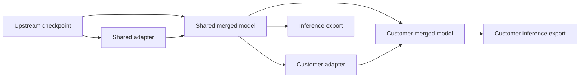

# Model lifecycle concepts

Foliqant adapts a pinned instruction model and records every resulting artifact.
It does not pretrain a new foundation model or define a new architecture. The
shared Foliqant model is a derivative release with an exact upstream parent and
inherited license, attribution and data restrictions.

## The artifacts

| Term | Meaning |
|---|---|
| Upstream checkpoint | Pinned model weights, tokenizer and configuration acquired from a named source revision. |
| Adapter | Small LoRA weights that require their exact model parent. An adapter is not a standalone model. |
| Shared derivative | A reusable shared adapter and, after merge, a dense shared model derived from the upstream checkpoint. |
| Customer adapter | A customer-scoped branch trained from an exact shared merged release. It cannot return to shared ancestry. |
| Merged model | Adapter weights fused into their parent, producing a standalone dense checkpoint for later transformation or export. |
| Export | A verified checkpoint or supported GGUF artifact intended for an independently tested inference runtime. |

A warm start loads a compatible completed adapter into a new training run. The
model parent, scope, customer, rank, scale, dropout, layer count and resolved
tensor shapes must match. It starts a new optimizer and random-number stream; it
does not resume optimizer state or modify the earlier artifact.

## LoRA, QLoRA and inference

Training an unquantized parent uses LoRA. Training an eligible quantized parent
uses QLoRA: the base weights stay quantized while the adapter is trained. Both
methods create adapter artifacts; full-weight fine-tuning is outside the current
tooling.

Merge creates dense weights for the exact adapter-parent pair. Quantization can
reduce weight memory, but it is a separate, recorded lossy transformation. An
export records intended runtime compatibility as unverified until you load it
and run bounded generation in that runtime. The CLI prepares and verifies model
artifacts; it does not host an inference endpoint.

## Starting on a 64 GB Apple Silicon Mac

Use native Apple Silicon macOS for the MLX training backend. The 64 GB on an
M1-family or M5-family Mac is unified memory shared with macOS and other
applications, not 64 GB of dedicated available GPU memory. A model size or chip
family alone does not prove that a run will fit or predict its speed.

For a first candidate-model experiment, a supported model around 8–12B is a
reasonable candidate to measure, not a capacity guarantee. Start with batch size
1, a 2k–4k sequence limit, a modest adapter rank, gradient checkpointing and a
short run. Record actual peak memory and throughput, then change one dimension at
a time. Quantization reduces base-weight memory but does not remove activation,
optimizer, tokenizer or operating-system memory. Do not promise long-context or
full-parameter training from a successful small LoRA run.

Validate deployment separately. A model that trains on unified memory may not
fit a 24 GB inference target or work with the same runtime. Test the exported
artifact on the intended MLX, LM Studio, Ollama, vLLM or other supported host
before recording compatibility evidence.

The workflow runtime is the separate root Python package. Model training does
not define inbound connectors, catalogs, routing rules, or business actions;
those workflow changes should not require model retraining by default.

Next: [set up the local workspace](setup.md), then
[train and export the first adapter](first-model.md).
