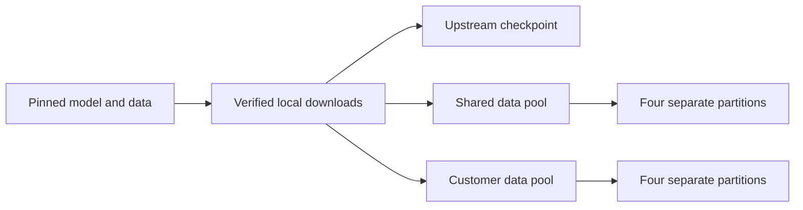

# Set up your local workspace

Run one command to install the isolated Python environment, download a small
model and dataset, and prepare separate data for shared and customer experiments.
Setup does not train a model or start a server.

## Before you start

Use native Apple Silicon macOS for local MLX training. Setup uses Python 3.12 in
the repository's `.venv`; it does not replace your system Python. Install
[uv](https://docs.astral.sh/uv/getting-started/installation/) and open a terminal
in the Foliqant checkout. The first run needs internet access for Python packages
and about 274 MB of model/data downloads. Allow additional disk space for the
environment, copied checkpoint and later training runs.

## Prepare everything

```sh
./scripts/setup-model
```

The command installs locked dependencies and prints one JSON success result.
`ok: true` means setup completed. The result gives these locations:

| Field | What it contains |
|---|---|
| `modelPath` | Verified upstream checkpoint |
| `sharedDatasetPath` | Prepared data for a shared adaptation |
| `customerDatasetPath` | Separate prepared data for customer customization |
| `trainConfigPath` | A short training recipe |
| `evaluationConfigPath` | A bounded evaluation recipe |
| `receiptPath` | Asset checksums and prepared artifact identities |

Downloads and outputs live under `~/.local/share/foliqant`, outside the checkout.
To use another disk, choose an absolute directory:

```sh
./scripts/setup-model --workspace /Volumes/ModelData/foliqant
```

Keep datasets, weights and training outputs out of Git even when you choose a
workspace inside a project. Configuration, preparation code and pinned source
manifests belong in version control; their downloaded contents do not.

## Understand the small exercise

Setup uses the pinned **SmolLM2-135M-Instruct** checkpoint and **Banking77** intent
classification data. It selects two disjoint pools of 154 examples from the
official training set. Each pool is then split into training, validation,
calibration and test partitions. The official Banking77 test set is downloaded
and checked but never used in these prepared pools.

These are diagnostic partitions, not the official Banking77 benchmark. The tiny
model is useful for checking a complete local process; it is not a recommended
production financial model.



## Run setup again

Existing files are reused only after their checksums pass. Once the Python build
dependencies and all assets have been cached, you can run entirely offline:

```sh
./scripts/setup-model --offline
```

`downloadedFiles: 0` and `reusedFiles: 14` indicate the pinned assets were reused.
A missing offline dependency or file is an error, not permission to download it.
An altered cached file is also an error; setup does not silently replace it.

To verify a checkpoint or dataset independently, use its path from setup:

```sh
uv run --no-sync foliqant-model verify /absolute/path/from/modelPath
```

Next: [train and export your first adapter](first-model.md).
