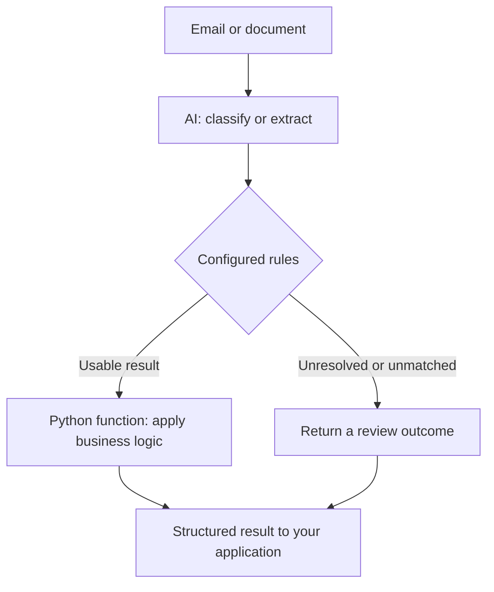

---
hide:
  - toc
---

Foliqant · Developer documentation

# Model decisions. Explicit control flow.

Build typed Python workflows that use AI for interpretation and deterministic rules for what happens next.

[Install and run](getting-started/runtime.md){ .md-button .md-button--primary }
[Follow the tutorials](tutorials/index.md){ .md-button }

## AI interprets. Your process decides what happens next.

An email, document, or support request rarely arrives as a tidy set of fields.
AI can identify its intent, assign labels, or extract information. Your business
process still needs explicit rules: which work is allowed, in what order, and
when a person should review the result.

Foliqant combines those two kinds of work. Model steps interpret selected input
and return typed results. Authored routes and trusted Python functions determine
how the process uses those results. The model does not invent the workflow graph.

For example, classify a message as a billing or cancellation request, route it
to the matching flow, extract the required fields, and apply your business
rules in Python. If the intent cannot be resolved, return `needs_review` for
the host application to handle.

Deterministic routing means the same validated result follows the same authored
rules. It does **not** mean a model always returns the same or a correct answer.
Use [evaluation against reviewed examples](guides/testing-and-evaluation.md)
to measure that separately.

## Workflow → flows → steps

| Building block | What you define | Example |
| --- | --- | --- |
| **Workflow** | The whole process: input, starting flow, allowed routes, and final output | Handle an incoming request |
| **Flow** | A sequential group of steps, its result, and what happens next | Classify a request, or handle billing |
| **Step** | One task with selected input and a typed result | Identify intent, extract fields, or call a Python function |

A workflow can contain one flow or several connected flows. Steps run in the
order you specify. At a routed flow's boundary, its configured transition
chooses another flow or a terminal outcome. Unresolved results use explicit
review handling. Your application awaits one call and receives an
`ExecutionResult` with the final payload and execution records.

### Choose the right step for the work

| Step type | Use it to… |
| --- | --- |
| `decision` | Classify, label, or answer typed questions, with reasoning, answerability, and evidence strength |
| `llm` | Extract structured fields or produce text; optionally use an allowlisted, bounded tool loop |
| `handler` | Run a trusted async Python function registered by your application, such as a calculation or business rule |
| `mcp` | Call one declared read-only external tool with explicit arguments |
| `flow_collection` | Run a bounded list of explicitly planned callable flows sequentially and collect their results |

Start with one flow and one step. Add other capabilities only when the process
needs them. See [runtime concepts](concepts/runtime.md) for the architecture
and execution boundaries.

## Start building

### Understand the building blocks

Learn how workflows, flows, and steps fit together, and which responsibilities
stay in your application.

[Explore runtime concepts →](concepts/runtime.md)

### Build one capability at a time

Six runnable tutorials take you from classification to extraction, routing,
tool calls, and processing several requests.

[Start the learning path →](tutorials/index.md)

### Configure your process

Define prompts, schemas, selected context, and routes using a conventional
file structure and explicit configuration.

[Build a workflow →](guides/build-workflows.md)

### Measure before you rely on it

Check wiring offline, evaluate against reviewed ground truth, and inspect
results, confusion matrices, and operational failures.

[Test and evaluate →](guides/testing-and-evaluation.md)

## Keep the reference close

- [Decision contracts](guides/decision-contracts.md) — typed questions,
  answerability, evidence, and application policy.
- [Configuration and CLI](reference/runtime-configuration.md) — providers,
  environment values, tools, limits, telemetry, and commands.
- [Evaluation results](guides/evaluation-results.md) — understand measurements
  and compare runs.
- [Configure with an AI agent](skills/foliqant.md) — a self-contained skill for
  translating a business process into a working configuration.

!!! note "A library inside your application"

    Foliqant runs in your Python process. Your application owns inbound HTTP,
    authentication, persistent jobs, and result storage.
