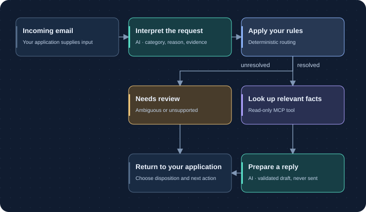

---
hide:
  - toc
---

The workflow is yours. AI handles the interpretation.

# Turn unstructured input into a process you control.

Classify an email. Extract the facts. Look up a record. Return a useful result. Build it as a typed Python workflow with explicit routes and clear review outcomes.

[Build your first workflow](getting-started/runtime.md){ .md-button .md-button--primary }
[Follow the support-email tutorial](tutorials/index.md){ .md-button }

Async PythonConfiguration as filesEvaluations included

## AI interprets. Your application decides what happens next.

Emails and documents contain requests, uncertainty, and conflicting information.
Use a model for the parts that need interpretation. Keep sequence, permissions,
routing, and final disposition in your authored process and application code.

<section class="process-demo" aria-label="Illustrative support-email routing">
  
Explore an authored processIllustration · no model calls

  
Choose an input to see the intended route. These are reviewed illustrative outcomes, not live predictions.

  

    <button type="button" data-scenario="billing" aria-pressed="true">A duplicate charge</button>
    <button type="button" data-scenario="cancellation" aria-pressed="false">Cancel a renewal</button>
    <button type="button" data-scenario="review" aria-pressed="false">An unclear request</button>
  

  

    <blockquote data-demo-input>“Please review the duplicate charge on invoice INV-7 for account A-100.”</blockquote>
    <ol class="process-demo__route">
      <li>01<strong>Interpret</strong>billing</li>
      <li>02<strong>Follow a rule</strong>Billing flow</li>
      <li>03<strong>Return a result</strong>Draft for an agent to review</li>
    </ol>
    
The message explicitly identifies a duplicate charge. The workflow selects the billing flow; nothing is sent or changed automatically.

  

</section>

Unresolved input is a normal business outcome. A valid assessment can say there
is not enough evidence, information conflicts, or several categories fit. Your
process can return `needs_review` instead of forcing a guess.

Deterministic routing means the same validated result follows the same rules.
It does not make a model deterministic or correct. Measure that with
[reviewed evaluations](evaluation/index.md).

## Find the capability you need

DECIDE
### Make a bounded decision
[Yes or no](steps/yes-no.md), [one category](steps/classification.md),
[several labels](steps/labeling.md), or [an urgency level](steps/ranking.md).
Get a typed answer with a reason and evidence strength.

EXTRACT
### Turn content into useful data
[Extract JSON fields](steps/llm.md) or [separate distinct requests](steps/request-extraction.md)
from a message. Validate the shape before the next operation uses it.

CONNECT
### Use tools with clear boundaries
[Call a known MCP tool](steps/mcp.md), [let a model choose tools](steps/agent-loops.md),
or [run a Python function](steps/handler.md). Keep tool access explicit.

DELIVER
### Put the result in your application
[Embed in Python](integration/index.md), [serve an HTTP endpoint](integration/http.md),
and [handle review or failure](integration/errors.md). Your host owns the final action.

## Three building blocks

| You define | Its responsibility | Support-email example |
| --- | --- | --- |
| **Workflow** | The complete process: input, routes, and final output | Handle an incoming email |
| **Flow** | A sequence of related operations | Classify, or prepare a billing response |
| **Step** | One operation with selected input and a validated result | Extract an account reference |

Start with one workflow, one flow, and one step. Add a branch or tool only when
your process needs it. Configuration lives in readable files; Python owns
integration and deterministic business functions.

<figure class="docs-figure">

<figcaption>AI interpretation inside an explicit process. Drafting is separate from sending or changing an account.</figcaption>
</figure>

[Understand workflows, flows, and steps →](concepts/runtime.md)

## From first request to a deployed application

1. **[Install and run](getting-started/runtime.md)** — start manually or [with Claude or Codex](skills/foliqant.md).
2. **[Define the process](configuration/index.md)** — learn the folder layout, data bindings, and routes.
3. **[Add a capability](steps/index.md)** — choose the task by the result you need.
4. **[Connect your provider](configuration/providers.md)** — local models, OpenAI, Azure, Anthropic, Google, or Bedrock.
5. **[Evaluate real requirements](evaluation/ground-truth.md)** — create reviewed cases and inspect disagreements.
6. **[Integrate and deploy](integration/index.md)** — handle requests, results, errors, secrets, and operational limits.

The **Guide** explains each task and its options. **Tutorials** build a support-email
assistant step by step. **Evaluation** helps you measure and improve it. Detailed
field and CLI lookups sit inside Guide when you need an exact contract.

!!! note "A library inside your application"

    Foliqant runs in your Python process. Your application owns inbound transport,
    identity verification, durable jobs, result storage, and any business writes.
    The core does not install a queue or a database.
