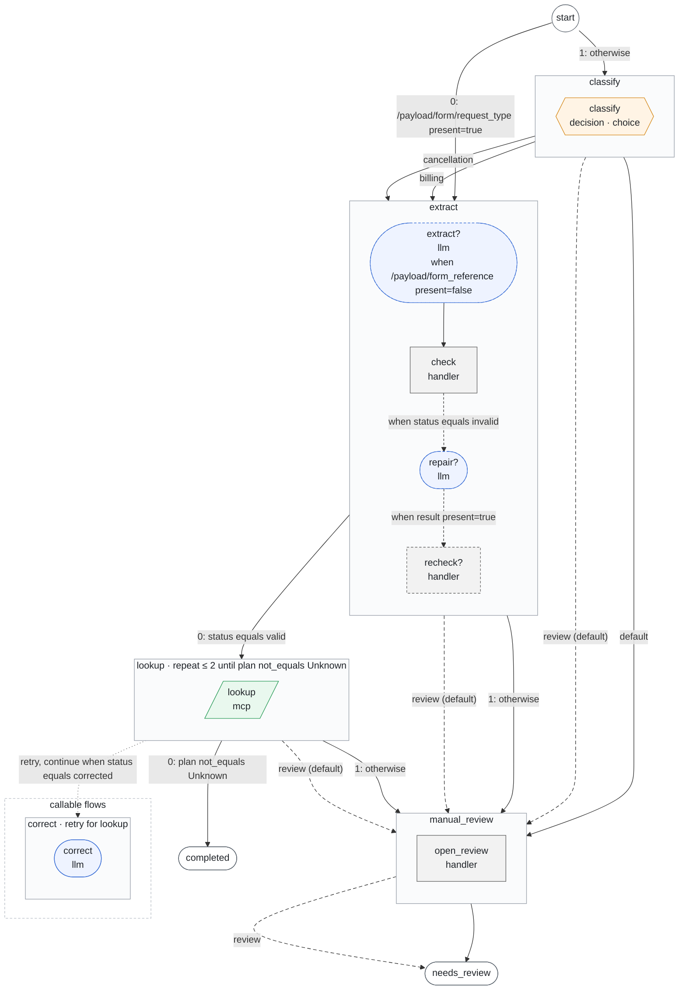

# Settings and CLI lookup

Use this page when you know what you need and want the exact entry point. For a
first application, start with [the configuration guide](../configuration/index.md).

## Settings file

The CLI defaults to `config/settings.yaml` relative to the working directory; it
does not search parent directories. Override it with `--config PATH`.

| Top-level key | Default | Guide |
| --- | --- | --- |
| `workflows` | Discover immediate nonhidden `config/*/workflow.yaml` | [Layout and discovery](../configuration/index.md) |
| `models` | Empty | [Model profiles](../configuration/models.md) |
| `mcp` | Empty | [MCP connections](../configuration/mcp.md) |
| `handlers` | Empty | [Declared handler contracts](../steps/handler.md#declare-the-contract-in-settings) |
| `execution` | Bounded execution defaults | [Time and capacity](../configuration/limits.md) |
| `telemetry` | Disabled | [Observability](../integration/observability.md) |
| `evaluation` | Conventional dataset location on explicit evaluation only | [Ground truth](../evaluation/ground-truth.md) |

An explicit `workflows` map uses public names as keys and workflow directories
relative to the settings file as values. Paths must remain within the allowed
configuration root. Duplicate keys, aliases, unknown fields, and custom YAML tags
are rejected.

## Execution limits

Defaults under `execution` are `concurrency: 4`, `queue_limit: 16`,
`run_timeout: 300`, `model_timeout: 60`, `tool_timeout: 30`, `max_steps: 32`,
`model_requests_per_step: 4`, and `tool_calls_per_step: 3`. Time values are seconds.
An LLM step separately defaults to `max_iterations: 4` logical model turns.

See [the limit tables](../configuration/limits.md) for scopes, allowed ranges,
timeout precedence, retries, and a slow local-model configuration. These are
per-process limits, not distributed queues or service-level guarantees.

## Model profiles

Providers: `openai`, `openai_compatible`, `azure_openai`, `anthropic`, `google`,
and `bedrock`. `model` and `output_mode` are required. Profiles have no reserved
name and there is no implicit model selection or model-list request.

Shared defaults: text/schema/tool capabilities enabled, four concurrent requests,
16 waiting requests, a 60-second request timeout, one attempt, and 4096 output
tokens. Explicit capabilities must match the actual model.

[Choose a provider](../configuration/providers.md) for native APIs, authentication,
and endpoint differences. [Configure models](../configuration/models.md) for step
selection, profile overrides, generation options, and structured-output modes.

### Provider retries

Both model and MCP profiles default to `max_attempts: 1`,
`initial_delay_seconds: 0.25`, and `max_delay_seconds: 5`. Retries are opt-in and
apply only to classified completed transient failures. They consume the existing
attempt and time budgets. Timeouts and ambiguous connection failures are not
automatically retried; see [retry behavior](../configuration/limits.md#enable-retries-only-for-completed-transient-failures).

## Environment references

Marked deployment fields accept whole-value `$NAME` references; `$$` escapes a
literal dollar. The runtime reads `.env` beside the selected settings file, then
overlays the host-supplied environment. Offline preparation resolves neither.
Prompts, schemas, inputs, numeric limits, and dataset paths stay literal.
See [secrets and environment](../configuration/environment.md).

## MCP profiles

Declare `transport`, an explicit `catalog`, and optional host credential/identity
hooks. Defaults are four active sessions, 16 waiting, a 30-second timeout, one
attempt, and a 1 MiB output limit. Built-in tool execution is read-only.
See [MCP setup](../configuration/mcp.md), [direct calls](../steps/mcp.md), and
[model-selected calls](../steps/agent-loops.md).

## Handlers

Each entry under `handlers` declares one trusted handler: `input_schema`,
`output_schema` (inline objects or local files relative to the settings file)
and `effect`. The host registers the callables with
`prepare_application(path, handlers=...)`; a registration must match its
declaration, an undeclared registration is `unknown_handler`, and a declared
handler without registration fails at `open_application` with
`missing_handler_registration`. Offline commands need no registrations. See
[handler steps](../steps/handler.md).

## Telemetry

Telemetry is disabled unless configured. A profile requires `service_name`;
trace and metric endpoints are independently optional; `conditions: true` adds
debug `condition.evaluated` events. Full defaults and safe data boundaries are
in [observability](../integration/observability.md).

## Evaluation dataset

The conventional path is `evaluation/dataset.json` beside `config/`. Optional
`evaluation.dataset` selects a literal path relative to the settings file.
Normal preparation and execution do not read gold. See
[evaluation setup](../evaluation/ground-truth.md) and [run/replay/compare](../evaluation/running.md).

## CLI reference

| Command | Purpose | External model/tool calls? |
| --- | --- | --- |
| `foliqant init DEST` | Create a small application template | No |
| `foliqant validate` | Compile and validate configuration; report diagnostics | No |
| `foliqant validate --strict` | Also fail when any warning is reported | No |
| `foliqant explain --workflow NAME` | Inspect the compiled process as JSON | No |
| `foliqant explain --workflow NAME --format mermaid` | Render one graph as Mermaid (`dot` for Graphviz) | No |
| `foliqant explain --workflow NAME --format mermaid --legend` | Render one graph with a legend of step shapes | No |
| `foliqant explain --format mermaid --all --output docs/workflows.md` | Write a Markdown document with every workflow graph | No |
| `foliqant explain --format mermaid --all --output docs/workflows.md --check` | Fail when that document is stale | No |
| `foliqant doctor` | Check configuration and optional dependencies; list model profiles with their `pricing` | No |
| `foliqant run --workflow NAME --input PATH` | Run one request file | As configured |
| `foliqant run --workflow NAME --input -` | Read one request from standard input | As configured |
| `foliqant evaluate --check` | Validate reviewed gold and targets | No |
| `foliqant evaluate` | Execute configured suites | As configured |
| `foliqant evaluate --replay REPORT` | Rescore saved complete results | No |
| `foliqant evaluate --compare CANDIDATE --baseline BASELINE` | Compare compatible reports | No |

Use `--help` on each command for its full argument list. `run` prints one JSON
result and exits. It does not start a server or persist a job. Handlers are
declared in settings, so `validate`, `explain`, `doctor` and `evaluate --check`
work for workflows with handlers; executing them needs the Python host that
registers the callables. The CLI never imports application functions from
configuration, so `run` fails with `missing_handler_registration` for such
workflows.

### Output streams

Standard output always carries exactly one JSON object (the result, or the
failure status) or, for `explain --format mermaid|dot`, the rendering. Standard
error carries readable text: one line per configuration problem, followed by a
summary line, or one line for any other failure:

```text
demo/workflow.yaml:10:7: workflow_cycle at flows.second.transition.flow: The flows form a cycle: `first` -> `second` -> `first`, so a run might never terminate. (hint: Remove route and callable-flow cycles so every invocation terminates.)
foliqant: invalid_configuration: 1 problem.
```

The JSON failure status has `error` (`code`, `message`, `retryable`, and for
configuration problems `reason`, `field`, `hint` and `location` of the first
problem), `problems` (every problem, structured like diagnostics) and
`diagnostics` (every finding). `run` also writes its safe JSON log events to
standard error.

### Exit codes

| Code | Meaning |
| --- | --- |
| `0` | Success, including `needs_review` results of `run` |
| `1` | `evaluate` found a gold mismatch, or `explain --check` found a stale file |
| `2` | Invalid arguments, input or configuration (every compiler error, and every warning under `--strict`) |
| `3` | A required optional dependency is not installed |
| `4` | Runtime failure of an operation |
| `130` | Interrupted |

For business review versus operational errors, see
[error handling](../integration/errors.md).

### Explain and generated documentation

`explain` prints the graph model as JSON by default. `--format mermaid|dot`
prints one graph and needs `--workflow` when several workflows are configured;
`--all` renders every workflow into one Markdown document with a
`## <workflow>` section each: its start and output projection, the fenced
diagram and its diagnostics. `--output PATH` writes the rendering to a file
(standard output then carries `{"command": "explain", "status": "written"}`),
and `--check` compares the file with the current rendering instead, exiting
with `1` when it is stale. Use it in CI to keep configuration documentation
from drifting:

```sh
foliqant explain --format mermaid --all --output docs/workflows.md
foliqant explain --format mermaid --all --output docs/workflows.md --check
```

Each flow is a subgraph holding its steps in authored order. The node shape
and color show the step type: a hexagon for `decision` (with its question
types, `decision · choice`), a stadium for `llm` (`llm · tools` with tools), a
rectangle for `handler`, a parallelogram for `mcp` and a subroutine box for
`flow_collection` (`flow_collection → <flows>`). A step with `when` has a
dashed border and a `?`; its condition labels the edge from the previous step
(`when status equals invalid`, pointers into that step's result shortened), or
the node itself for a first step. Edges between flows connect the subgraphs:
routes are solid and labelled with the case key, `default`, or the route
entry and its condition with authored operands (`0: status equals valid`,
`in [a, b]`, `gt 3`, `matches /FOI-[0-9]+/`, `present=false`; pointers into the
source flow's own result are shortened), review routes are dashed, and
collection (`calls`) and retry calls are dotted. A repeat is annotated in the
flow's title (`lookup  ·  repeat ≤ 2 until plan not_equals Unknown`). Callable
and retry flows are grouped under `callable flows` after the routed flows, so
the main path reads top-down; `start` is a circle and outcomes are stadiums.
Condition texts longer than 60 characters end with `…`. Graphviz output has
the same structure with one cluster per flow. `--legend` (or
`render_mermaid(graph, legend=True)` and `render_dot(graph, legend=True)`)
appends one node per step type and a conditional example; the `--all`
document shows the legend once at its top. Literal bindings and default values
are never shown. `foliqant.graph.render_document(prepared)` returns the same
document, and `foliqant.explain(prepared, workflow)` the graph model.

The `account_intake` workflow of the conditional intake example renders as:



## Diagnostics

`validate`, `explain` and `doctor` report compiler findings in `diagnostics`,
each with `code`, `level` (`warning` or `info`), `message`, `location` (`path`,
`line`, `column`), `field` (the key path inside that file) and `hint`. Errors
fail compilation. With `validate --strict`, or
`prepare_application(..., strict=True)` in Python, warnings fail too and the
failure lists every warning. [What the compiler guarantees](../configuration/validation.md)
lists every error and warning with an example and its fix.

| Code | Level | Meaning |
| --- | --- | --- |
| `uncovered_value` | warning | an allowed value of a `cases` field has no case (see `default_covers`) |
| `condition_always_false` / `condition_always_true` | warning | a condition cannot vary for the known values |
| `route_unreachable_entry` | warning | a `route` entry can never be selected |
| `repeat_without_retry` | warning | a repeated flow with a model step has no retry flow |
| `unused_llm_input` | warning | an LLM input is not referenced by its `prompt` and is never sent |
| `collection_budget` | warning | `max_items × worst(child)` (nested collections and item repeats included) may exceed `execution.max_steps` |
| `run_budget` | warning | the most expensive path from a start, with every repeat attempt, retry run and collection item, may exceed `execution.max_steps` |
| `review_ends_run` | warning | a flow without a review route ends the run in review and the host would not receive that flow's projected result |
| `review_ends_run` | info | the same, when the reviewing flow is the one the workflow output returns |
| `case_on_unknown_type` | info | a `cases` field has no known value set |
| `empty_text_source` | info | a decision `text` source may be an empty string |

`PreparedApplication.diagnostics` exposes the same list.

Evaluation defaults: one concurrent case, a 300-second case timeout, one attempt
per case. Reports use a new file under `.foliqant/evaluations/` beside settings
unless `--output` chooses another new path. Never commit private reports.

## Installed schemas

Python boundary models are authoritative. Generated JSON Schema files are shipped
for editors and validators; the runtime does not load those copies. Access one
without depending on a checkout layout:

```python
from importlib.resources import files

deployment_schema = files("foliqant").joinpath("schemas", "deployment.schema.json")
```

`foliqant.contracts.schemas.runtime_schemas()` and `decision_schemas()` generate
the same schemas from the installed models. See [public data fields](inputs-and-results.md)
for the advanced input/result contract lookup.
