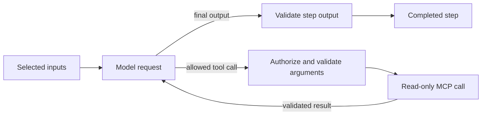

# Configure a bounded agent loop

A bounded agent loop is an `llm` step with an MCP tool policy. The model may
request an allowlisted read-only tool, receive its validated result, and then
produce the step's text or schema-constrained output. It remains one step in one
sequential flow.

It is not an autonomous workflow agent: it cannot choose flows, extend its
allowlist, change authorization, persist memory, create background work, or run
beyond the configured deadlines and attempt budgets.

## Prepare model and MCP capabilities

The selected model profile must set `supports_tools: true` and support the
chosen output kind. The named MCP profile must declare every allowed tool with
an exact catalog and `effect: read`. Configure both in `config/settings.yaml`;
see [models](../configuration/models.md) and [MCP](../configuration/mcp.md).

## Add a tool policy to the LLM step

This runnable definition is used by the
[model tool-loop tutorial](../tutorials/model-tool-loop.md):

```markdown
---
type: llm
input:
  message:
    pointer: /payload/message
output:
  schema: answer.schema.json
tools:
  server: records_office
  allow:
    - lookup_request
  choice: required
---
Answer a public-record request status question. Select the reference and language
from the supplied message, then use lookup_request. Return only the reference,
language, status and due_date from the validated tool response. Never invent a
status or due date.
```

`server`, a nonempty unique `allow` list, and `choice` are required:

| `choice` | Behavior |
| --- | --- |
| `auto` | The model may answer without a tool or call any allowed tool |
| `required` | At least one allowed tool call must succeed before final output |
| `name: lookup_request` | That exact allowed tool must succeed before final output |

After the required call succeeds, the model may produce the final answer or
make another allowed call while budgets remain.

## Understand the bounded loop



Each provider turn consumes one `model_requests_per_step` attempt and each tool
call consumes one `tool_calls_per_step` attempt. Defaults are four model requests
and three tool calls. The root `run_timeout`, per-attempt model/tool timeouts,
provider admission limits, and MCP limits also apply. Tool calls emitted together
are executed sequentially, so a batch cannot create unbounded MCP work.

The runtime creates fresh model and MCP state for every invocation. It forwards
only declared inputs and tool results; there is no history from another step or
run. This source-checkout example registers the tutorial's scripted model factory
while retaining the configured real local MCP client:

```python
from examples.model_tool_loop import offline
from examples.model_tool_loop.run import CONFIG_PATH, DEMO_PAYLOAD, runtime_environment
from foliqant import Envelope, RuntimePlugins, open_application, prepare_application

prepared = prepare_application(CONFIG_PATH)
plugins = RuntimePlugins(model_factory=offline.model_factory)
async with open_application(
    prepared,
    environment=runtime_environment(live=False),
    plugins=plugins,
) as app:
    result = await app.run(
        "request_assistant",
        Envelope(payload=DEMO_PAYLOAD),
    )
```

For deployed HTTP MCP, `RuntimePlugins` can also receive `mcp_credentials` and a
resource-aware `tool_authorizer`. The profile's `auth` name must match its
`mcp_credentials` key. The authorizer receives every tool request. Model
selection never grants permission.

## Handle review and failure

If the MCP server requests caller input, the LLM step returns `needs_review` and
the flow stops at its unresolved boundary. If a required or named tool never
succeeds, final validation fails with `invalid_output`. Invalid tool arguments,
authorization denial, catalog drift, timeouts, provider failures, and exhausted
budgets retain their stable technical error semantics; they are not converted
to review.

Do not retry an entire agent loop after an ambiguous timeout. Any completed tool
call may already have been observed externally, even though current tools are
restricted to read effects.

The tutorial runs a scripted model through a real local MCP session, which proves
wiring and tool-result delivery without a model endpoint. Add reviewed live cases
before relying on model tool selection; see [running evaluations](../evaluation/running.md)
and [unit testing](../evaluation/unit-testing.md).
