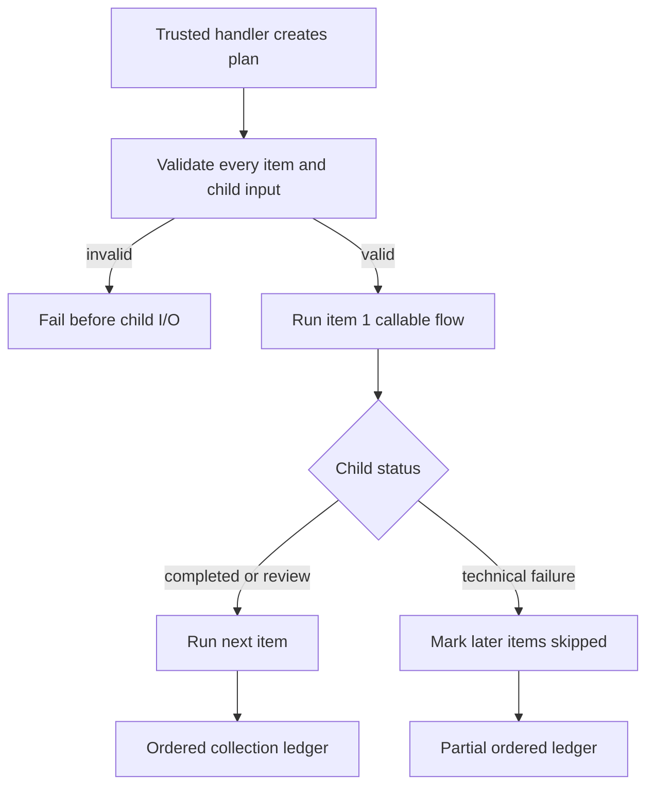

# Configure a flow collection

A `flow_collection` step executes an application-planned list of callable flows
in supplied order. Use it after trusted code has turned a reviewed assessment
into independent `{id, flow, input}` items. Foliqant supplies bounded composition;
the host still owns business planning, durability, retries, and recovery.

## Declare callable flows

Callable flows have steps, an optional input schema, and an optional output
projection. They have no workflow input bindings or boundary routes:

```yaml
# config/intake/workflow.yaml
flows:
  process:
    input:
      items:
        pointer: /flows/plan/result/items
    definition: process/flow.yaml
    transition:
      flow: finalize
    on_unresolved:
      flow: finalize
  lookup_status:
    callable: true
  prepare_guidance:
    callable: true
```

Conventional callable definitions resolve to
`config/intake/lookup_status/flow.yaml` and
`config/intake/prepare_guidance/flow.yaml`. A callable cannot be the workflow
start or a transition target; a collection cannot call a routed flow.

## Supply the planned items

The collection step binds one array and allowlists callable targets:

```yaml
# config/intake/process/requests.step.yaml
type: flow_collection
items:
  pointer: /payload/items
flows:
  - lookup_status
  - prepare_guidance
max_items: 8
```

`max_items` defaults to `32` and accepts `1` through `1024`. Each item has
exactly this public shape:

```yaml
- id: request_1
  flow: lookup_status
  input:
    reference: PR-1042
    language: en
- id: request_2
  flow: prepare_guidance
  input:
    topic: filing
```

IDs must be unique, `flow` must appear in the step allowlist, and `input` must
match that callable flow's input schema. The runtime validates the entire list
before any child I/O begins. An empty list completes successfully.

## Understand sequential execution



Children share the root execution ID, admission slot, absolute deadline, visited
step budget, caller metadata, and per-step model/tool budgets. Each child receives
only its item's `input` as payload. Items run sequentially. Repeated calls to the
same callable flow retain separate ledger entries.

Nested collections are allowed only through an acyclic callable-flow graph and
are limited to 16 collection levels. Compilation rejects cycles and statically
known deeper chains.

## Read the ledger and disposition

The public step record includes `kind: flow_collection`. A successful or review
record exposes ordered child records under `result.items`; each contains `id`,
`flow`, status, its complete step ledger, projected result when present, usage,
timing, and any safe error.

A child `needs_review` stays in the ledger and later independent items continue.
After all items, the collection becomes `needs_review`; the enclosing routed
flow uses its `on_unresolved` policy. A later trusted handler can inspect the
complete collection result and decide a business disposition explicitly.

The first technical child failure stops new work. The collection step is
`failed`, has no success `result`, and preserves completed, review, failed, and
remaining skipped child records under `partial_result.items`. Cancellation also
prevents later items from starting.

Do not call `app.run_flow` repeatedly inside a handler to imitate a collection:
each call is a separate root execution with independent limits and records.
Collections provide parent-owned composition, but no queue, parallel fan-out,
checkpoint, resume, persistence, or automatic dependency scheduler.

The [multi-request tutorial](../tutorials/multi-request-processing.md) shows
request-unit assessment, a trusted planning handler, two callable flows, the
collection, and a final disposition handler. Test the full ledger plus isolated
callable flows; see [collection scoring](../evaluation/task-types.md) and
[running evaluations](../evaluation/running.md).
