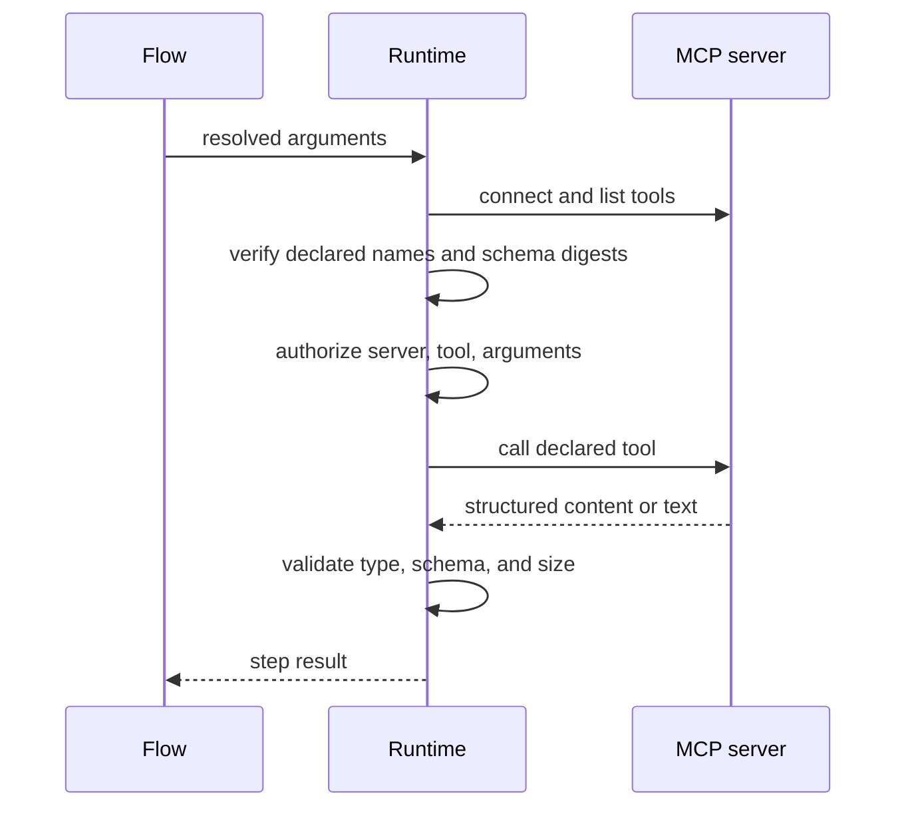

# Configure an MCP step

An `mcp` step calls one predetermined tool on one declared MCP server. Use it
when workflow configuration, rather than a model, should select the operation.
The current runtime permits only tools declared with `effect: read`.

## Declare the server and tool first

Add the transport and operator-reviewed catalog under `mcp` in
`config/settings.yaml`. The server must expose the declared name and exact input
and output schemas when the runtime discovers it. See
[MCP configuration](../configuration/mcp.md) for HTTP, stdio, credentials,
authorization hooks, retries, and limits.

The step then refers to the aliases:

```yaml
# config/public_request_lookup/lookup/lookup.step.yaml
type: mcp
server: records_office
tool: lookup_request
arguments:
  reference:
    pointer: /payload/reference
```

`server` and `tool` are required. `arguments` is a required mapping of literal
or pointer bindings. The resolved object must match the catalog's input schema.

## Follow the call lifecycle



The default authorizer enforces the compiled allowlist and read-only declaration.
A host may inject a stricter resource-aware authorizer:

```python
plugins = RuntimePlugins(tool_authorizer=my_authorizer)
async with open_application(prepared, environment=environment, plugins=plugins) as app:
    result = await app.run("public_request_lookup", envelope)
```

Caller authentication and business permission remain host responsibilities.
Tool arguments or metadata do not grant authority. Do not place credentials in
workflow bindings; HTTP credentials are supplied through named
`RuntimePlugins(mcp_credentials={...})` providers.

## Read the normalized result

If the catalog declares `output_schema`, the server must return structured
content that validates against it. The step result is that JSON value. Without
an output schema, the server must return only text blocks; the runtime joins
them with newlines and records one string. `output_limit_bytes` bounds either
form.

An MCP `InputRequiredResult` becomes a `needs_review` step with `result: null`.
The enclosing flow handles it through `on_unresolved`. Other outcomes are
technical failures:

| Condition | Safe failure |
| --- | --- |
| Argument schema mismatch | `invalid_input` |
| Missing/changed discovered tool or catalog mismatch | `dependency_failure` |
| Undeclared or unauthorized tool | `forbidden` |
| Invalid, oversized, or wrong result form | `invalid_output` |
| Request deadline reached | `timeout` |
| Server/protocol failure | `dependency_failure` |

The operation has one deadline across connection, discovery, authorization, and
call. Configured retries apply only to safely observed transient responses; the
runtime does not retry ambiguous timeouts or the whole step.

Run the [read-only MCP tutorial](../tutorials/read-only-mcp.md) for a real local
stdio server with no model request. For model-selected tool use, continue with
[bounded agent loops](agent-loops.md). Evaluate argument and result behavior as
described in [task scoring](../evaluation/task-types.md).
