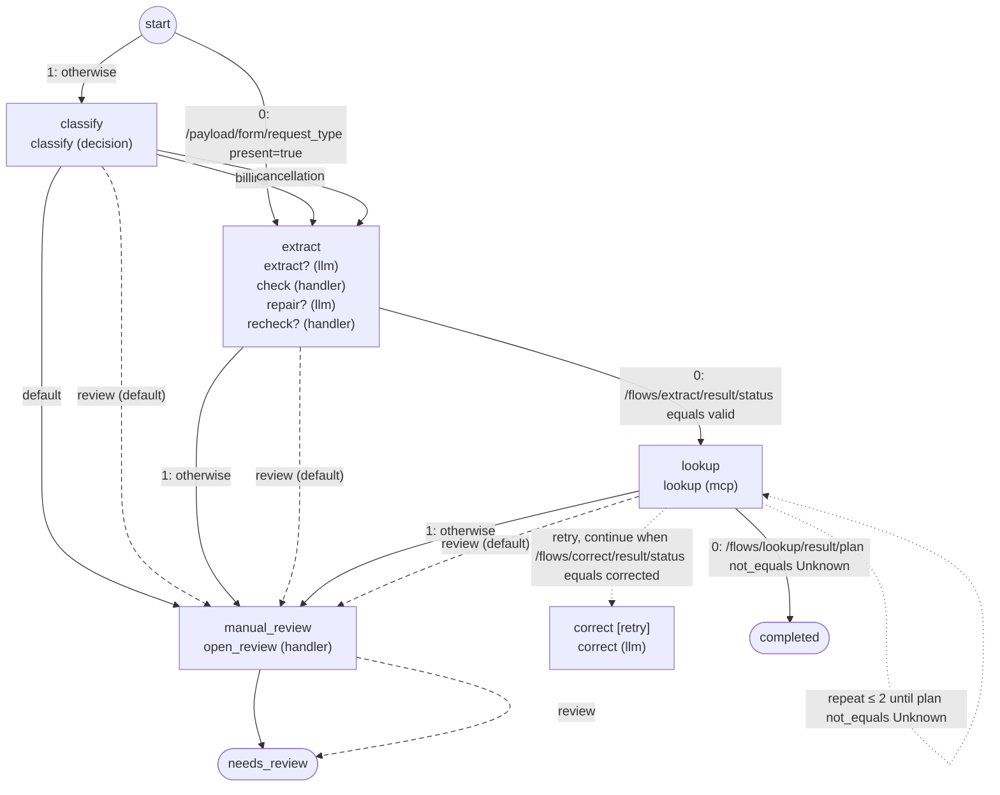

# Workflows

Generated by `foliqant explain --format mermaid --all`; regenerate it after changing the configuration instead of editing it.

## account_intake

Start: `extract` when `/payload/form/request_type present=true`; otherwise `classify`. Output: an object with `queue`, `account`, `review`.

Diagnostics: none.
