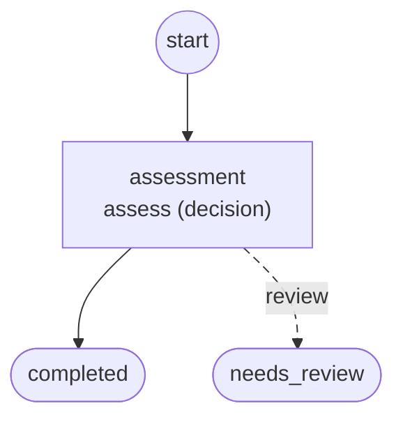

# Workflows

Generated by `foliqant explain --format mermaid --all`; regenerate it after changing the configuration instead of editing it.

## decision_evidence

Start: `assessment`. Output: `/flows/assessment/result`, else its default.

Diagnostics: none.

## decision_predicate

Start: `assessment`. Output: `/flows/assessment/result`, else its default.

Diagnostics: none.
