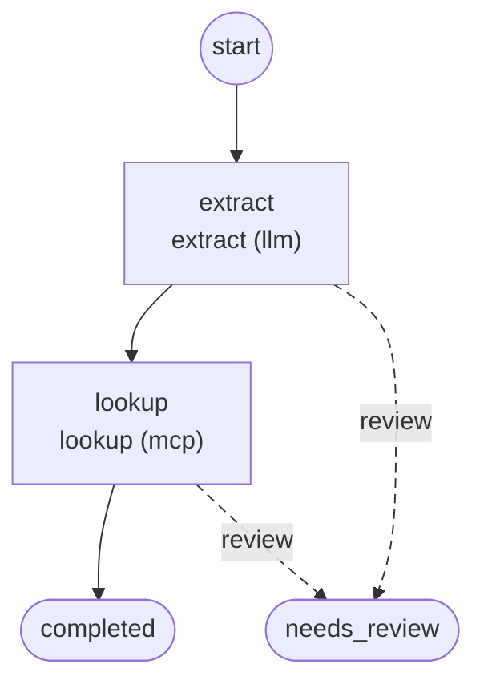

# Workflows

Generated by `foliqant explain --format mermaid --all`; regenerate it after changing the configuration instead of editing it.

## extracted_request_lookup

Start: `extract`. Output: `/flows/lookup/result`, else its default.

Diagnostics:

- info `review_ends_run` in `extracted_request_lookup/workflow.yaml:18:3` at `flows.lookup.on_unresolved`: Flow `lookup` has no review route: when it stops for review the run ends with needs_review and the host receives the projected result of `lookup`.
