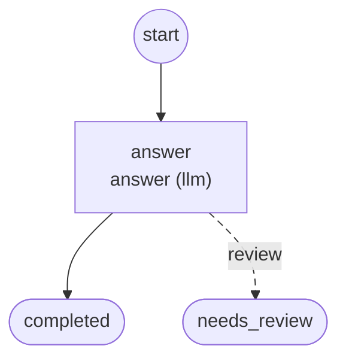

# Workflows

Generated by `foliqant explain --format mermaid --all`; regenerate it after changing the configuration instead of editing it.

## request_assistant

Start: `answer`. Output: `/flows/answer/result`.

Diagnostics:

- info `review_ends_run` in `request_assistant/workflow.yaml:4:3` at `flows.answer.on_unresolved`: Flow `answer` has no review route: when it stops for review the run ends with needs_review and the host receives the projected result of `answer`.
