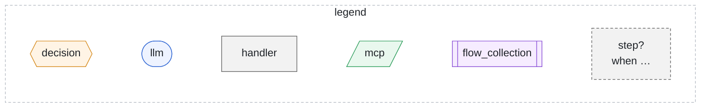
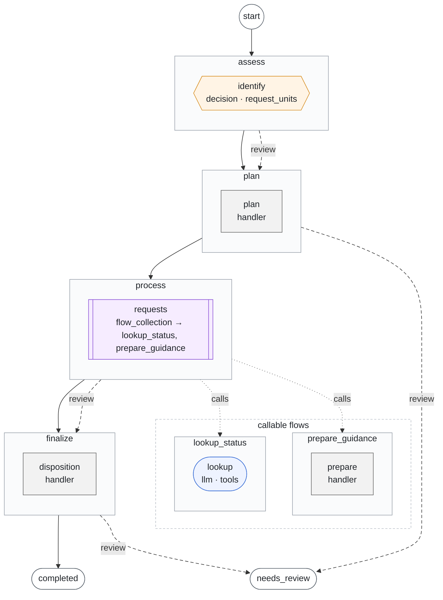

# Workflows

Generated by `foliqant explain --format mermaid --all`; regenerate it after changing the configuration instead of editing it.

Each flow is a box with its steps in order; the shape and color show the step type. A dashed step marked `?` runs only when its condition, shown on the edge into it, holds. Solid edges are routes, dashed edges review routes and dotted edges calls of the flows grouped under callable flows.

## intake

Start: `assess`. Output: `/flows/finalize/result`, else its default.

Diagnostics:

- info `review_ends_run` in `intake/workflow.yaml:36:3` at `flows.finalize.on_unresolved`: Flow `finalize` has no review route: when it stops for review the run ends with needs_review and the host receives the projected result of `finalize`.
