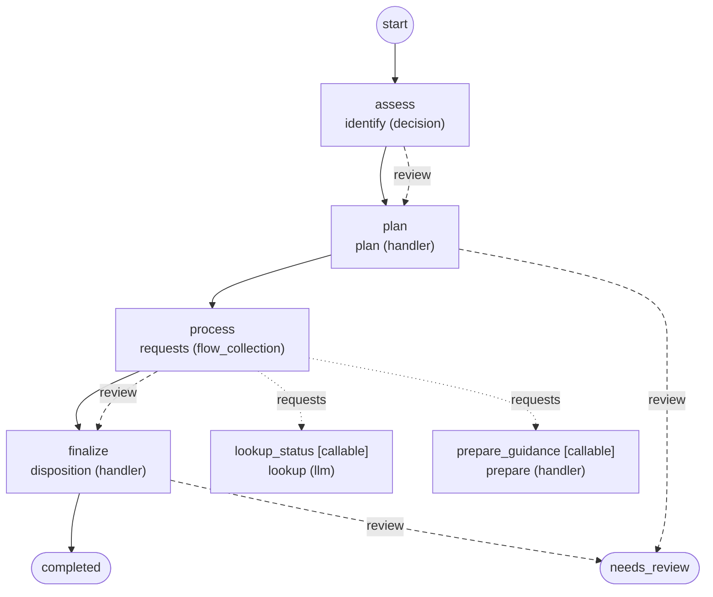

# Workflows

Generated by `foliqant explain --format mermaid --all`; regenerate it after changing the configuration instead of editing it.

## intake

Start: `assess`. Output: `/flows/finalize/result`, else its default.

Diagnostics:

- info `review_ends_run` in `intake/workflow.yaml:36:3` at `flows.finalize.on_unresolved`: Flow `finalize` has no review route: when it stops for review the run ends with needs_review and the host receives the projected result of `finalize`.
