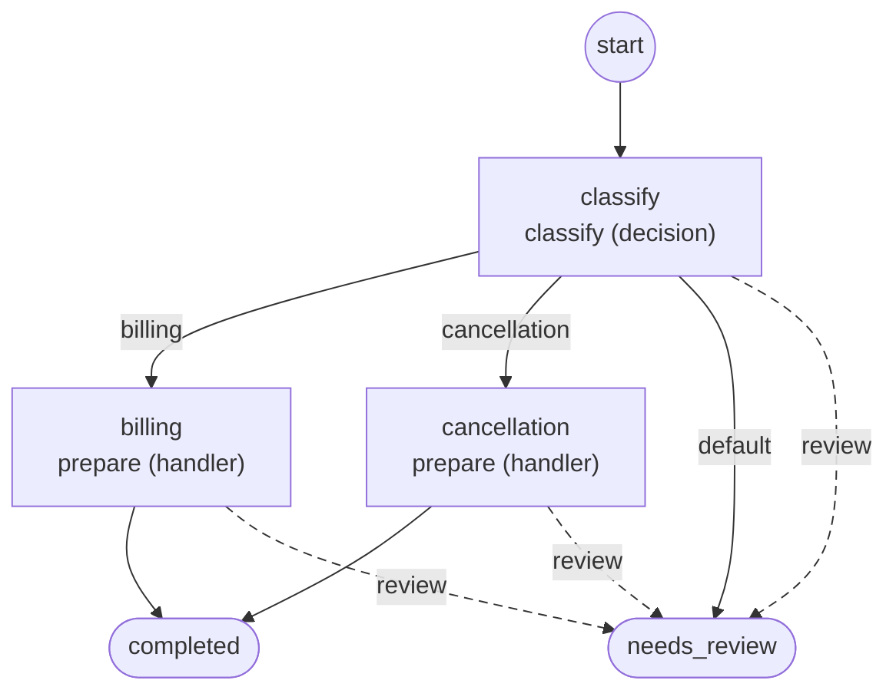

# Workflows

Generated by `foliqant explain --format mermaid --all`; regenerate it after changing the configuration instead of editing it.

## routed_intake

Start: `classify`. Output: the accepted input payload.

Diagnostics: none.
