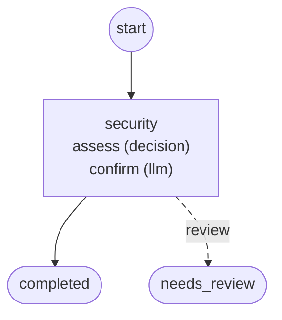

# Workflows

Generated by `foliqant explain --format mermaid --all`; regenerate it after changing the configuration instead of editing it.

## prompt_security

Start: `security`. Output: `/flows/security/result`.

Diagnostics: none.
