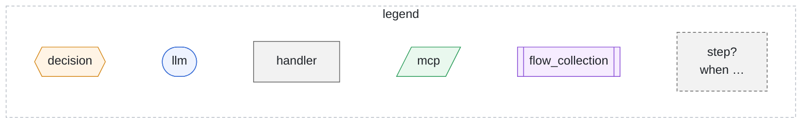
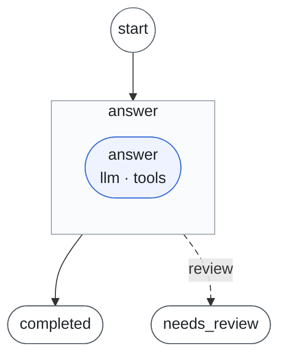
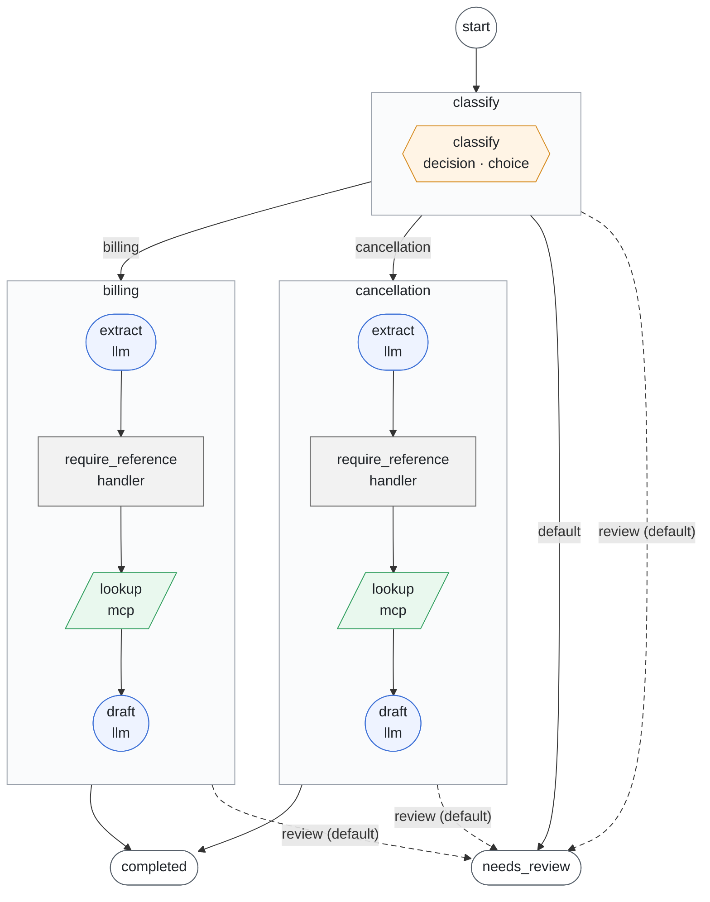
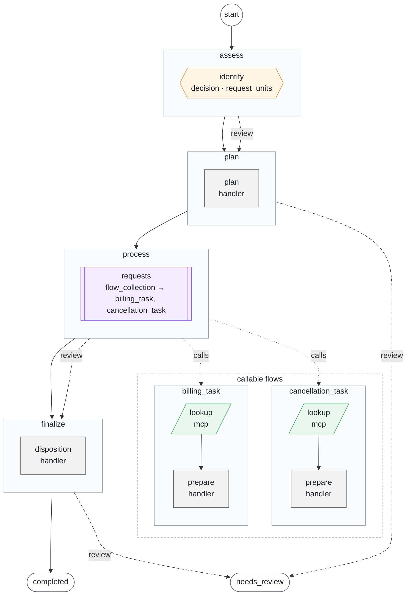

# Workflows

Generated by `foliqant explain --format mermaid --all`; regenerate it after changing the configuration instead of editing it.

Each flow is a box with its steps in order; the shape and color show the step type. A dashed step marked `?` runs only when its condition, shown on the edge into it, holds. Solid edges are routes, dashed edges review routes and dotted edges calls of the flows grouped under callable flows.

## agent_reply

Start: `answer`. Output: `/flows/answer/result`, else its default.

Diagnostics: none.

## support_email

Start: `classify`. Output: the first present of `/flows/billing/result`, `/flows/cancellation/result`, else its default.

Diagnostics: none.

## support_multi

Start: `assess`. Output: `/flows/finalize/result`, else its default.

Diagnostics: none.
