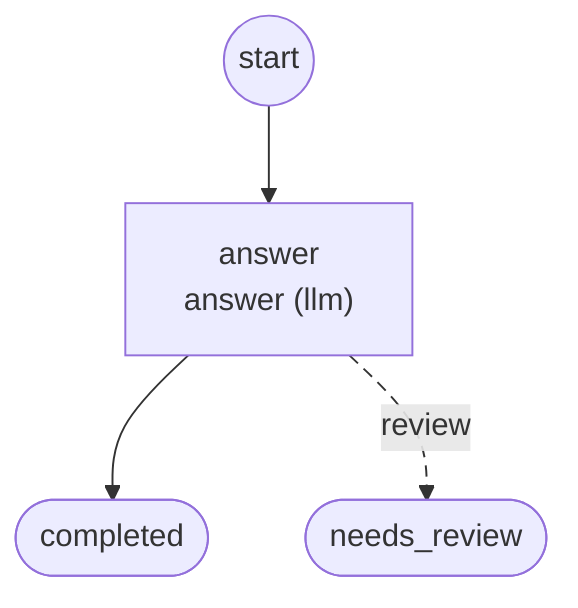
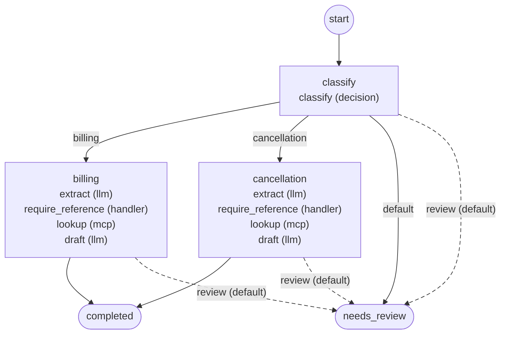
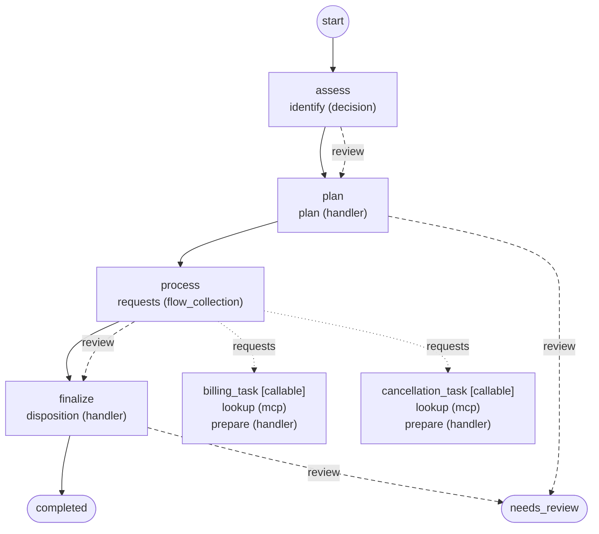

# Workflows

Generated by `foliqant explain --format mermaid --all`; regenerate it after changing the configuration instead of editing it.

## agent_reply

Start: `answer`. Output: `/flows/answer/result`, else its default.

Diagnostics: none.

## support_email

Start: `classify`. Output: the first present of `/flows/billing/result`, `/flows/cancellation/result`, else its default.

Diagnostics: none.

## support_multi

Start: `assess`. Output: `/flows/finalize/result`, else its default.

Diagnostics: none.
