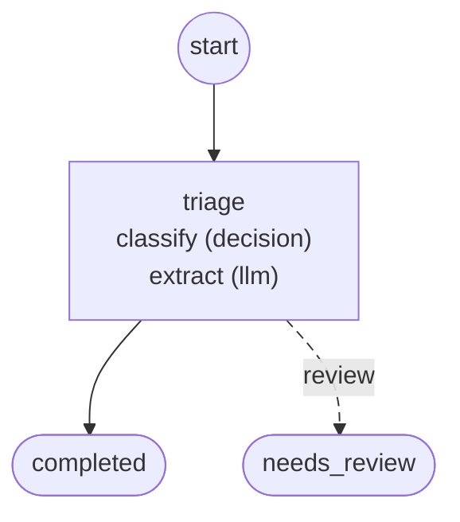

# Workflows

Generated by `foliqant explain --format mermaid --all`; regenerate it after changing the configuration instead of editing it.

## support_triage

Start: `triage`. Output: `/flows/triage/result`, else its default.

Diagnostics: none.
