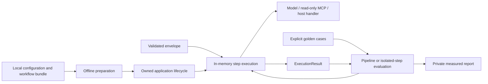
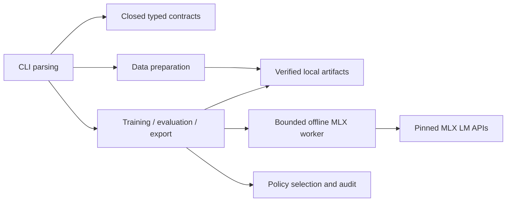

# Package and model-development architecture

The implemented [Python package](11-python-package.md) owns in-memory pipelines,
step/pipeline evaluations and model/MCP adapters. Reusable code lives in
`src/foliqant`; workflow bundles and optional HTTP hosting live in examples.
Model lifecycle tooling below stays in its separate `model/` project.

The [archived business-process concept](10-business-decisions-and-processes.md)
is background only. Durable parent/child jobs are not part of this library.

The caller owns persistence and any incoming transport. Compilation reads local
files; execution uses frozen plans and caller context. Evaluation never discovers
endpoints or creates a judge. Native decision contracts are shared with model
tooling, but training dependencies do not enter the root runtime environment.

The scoped source-projection extension has two explicit boundaries. Offline
preparation reads verified immutable source snapshots and produces a typed,
hash-bound plan without discovery, downloads, or inference. A separate native
curation child accepts that plan only after its parent has completed, preserving
old work and adding new train-only verification jobs. The active run's checkout,
environment and snapshots are not modified by concurrent preparation. Default
native recipes retain their original task and request identities.

The parent process validates configuration and lineage, reserves the output and supervises the child. The child handles real model operations using verified local files and returns a typed private result. Finalization validates actual files and publishes a manifest atomically; failures retain only a private incomplete workspace. Every derived artifact records immutable parent identities, rights and exact leakage indexes. No mutable model alias is a parent identity.

The lifecycle has two independent branches after shared model release: customer adapters derive from the exact shared checkpoint, while inference deployments use exported artifacts. An adapter never becomes compatible with a different parent by renaming. The model CLI does not host inference endpoints. It reuses `foliqant.decisions` from the root package without importing its workflow runtime.

Native decision-data generation is a mode of the curation boundary, not a new
training or inference service. It reuses source acquisition, immutable endpoint
caching, frozen-family planning and dataset publication. Oracle construction and
source projection feed canonical `DataRecord` values; only training-partition
native parents can reach local generation. The raw five-source corpus remains a
separate auxiliary artifact.

An explicit native `curate --continue-from RUN` snapshots an interrupted run
into an immutable child after a generator repair. Keep completed outcomes and
their original record/request/prompt provenance unchanged, including quarantined
outcomes. Use the current recipe only for unfinished jobs. Require identical
configuration, sources, native seeds, frozen families, logical jobs and observed
model; revalidate carried records against current semantic and preservation
checks. Record the parent snapshot and current recipe in `continuation.json`.
This is not rejection repair or silent cache migration. The same continuation
command resumes the child. Preparation may initialize it without inference.
