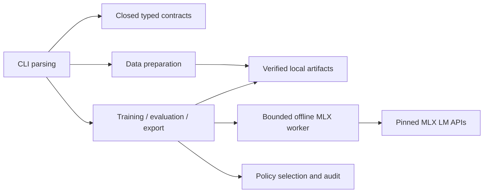

# Model tool architecture

The parent process validates configuration and lineage, reserves the output and supervises the child. The child handles real model operations using verified local files and returns a typed private result. Finalization validates actual files and publishes a manifest atomically; failures retain only a private incomplete workspace. Every derived artifact records immutable parent identities, rights and exact leakage indexes. No mutable model alias is a parent identity.

The lifecycle has two independent branches after shared model release: customer adapters derive from the exact shared checkpoint, while inference deployments use exported artifacts. An adapter never becomes compatible with a different parent by renaming. The CLI does not host inference endpoints or implement the future workflow service.
